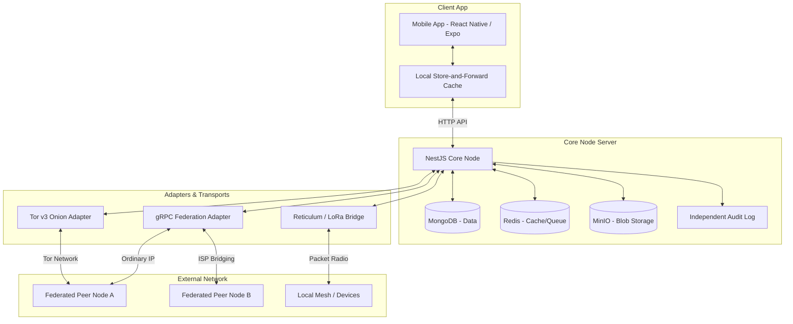

# Jagoo Bahee - Project Presentation

## 1. Overview
**Jagoo Bahee** is a federated, censorship-resistant community platform designed to maintain vital forum and emergency signaling capabilities even in constrained, heavily monitored, or entirely disconnected networks. 

The primary problem it solves is keeping communication channels open during network disruptions, censorship events, or complete internet blackouts, transitioning seamlessly across a "Resilience Ladder" from global internet down to local radio networks.

---

## 2. End-to-End Architecture Diagram

---

## 3. Core Concepts & Features Explanation

### 3.1. Dual Identity Planes
To ensure absolute security for high-profile users (like activists or emergency responders), the system enforces a strict separation between two identity planes:
*   **Plane A - FORUM (Pseudonymous):** Designed for open community discussion. Identities are derived keys with no real-world bindings. Content is trusted because it is signed, not because of *who* signed it.
*   **Plane B - SIGNAL (Identified):** Designed for emergency broadcasts and person-to-person communication. Identities are bound to verifiable claims. Used for verified channels, emergency broadcasts, and identified end-to-end encrypted (E2EE) messaging.

### 3.2. The Resilience Ladder
The application does not have a "kill switch." Instead, it gracefully degrades one step at a time based on available connectivity:
1.  **L0 (Global):** Normal internet connectivity.
2.  **L1 (National):** International transit is cut, but the domestic exchange (BDIX) is alive.
3.  **L2 (ISP Local):** Exchanges are down; each ISP is an isolated island.
4.  **L3 (Multi-homed Bridging):** Two isolated ISP islands are bridged by a node with two uplinks.
5.  **L4 (LAN / Mesh):** No wide-area IP; relies on local network instances and phone-to-phone relays.
6.  **L5 (Reticulum / LoRa):** No IP available. Falls back to packet radio and LoRa for Signal Plane emergency broadcasts.

### 3.3. Abuse Resistance without Deanonymization
Since Plane A (FORUM) requires anonymity, standard IP-based or email-based blocking does not work. Jagoo Bahee implements:
*   **Proof of Work (PoW):** Requires computational effort to post, mitigating spam.
*   **Blind Credentials & Epoch Nullifiers:** Allows users to prove they are verified humans or community members without revealing *which* member they are.

### 3.4. Federation and Synchronization (gRPC)
*   **Multi-Node Trust (TOFU):** Independent nodes federate with each other via gRPC, discovering peers through a cached peer directory.
*   **Backfill and Sync:** If a node goes down and comes back up, it automatically backfills missing posts and data from its trusted peers.
*   **Pre-positioned Peer Discovery:** Nodes cache network topologies (ASNs, ISPs) continuously so they know how to route locally the moment the global gateway drops.

### 3.5. Censorship Defeat Mechanisms
*   **Tor Onion Services:** Nodes can automatically publish themselves over Tor v3 hidden services, masking their physical location and bypassing national firewalls.
*   **Third-Party Audit Logs:** Independent append-only audit logs ensure that even server administrators cannot silently censor or alter signed records without being cryptographically caught.

### 3.6. Robust Data Layer
*   The backend stack utilizes **MongoDB** (for transaction-capable document storage), **Redis** (for caching and job queues), and **MinIO** (for S3-compatible media/blob storage).
*   All data mutations in the system are universally packaged as cryptographically **Signed Envelopes**.

### 3.7. Offline Store-and-Forward Client
*   The frontend mobile app (React Native) is fully offline-capable. Users can read cached feeds, write posts, and vote while disconnected. These actions are stored locally and automatically dispatched (forwarded) when connectivity to any rung of the resilience ladder is restored.
