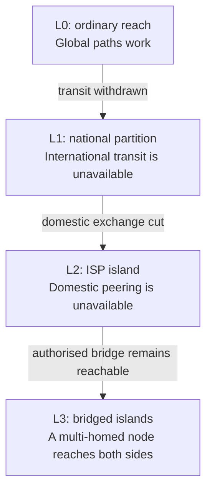
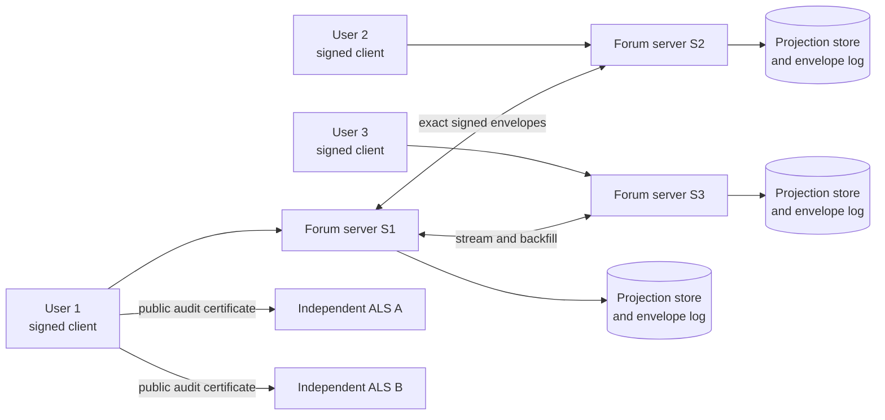
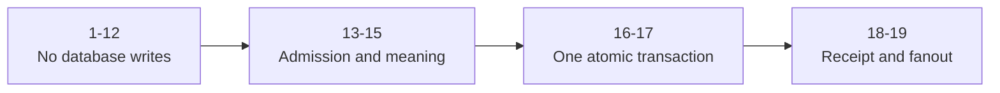
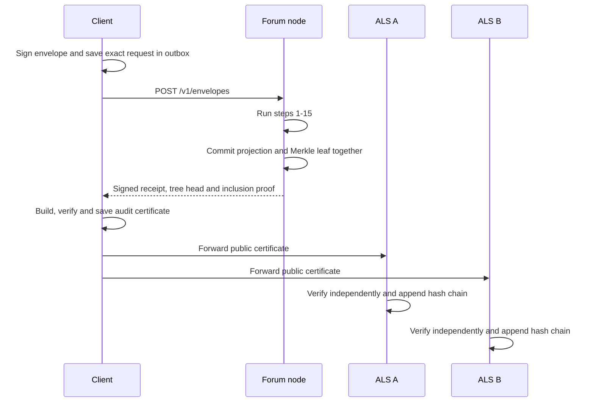
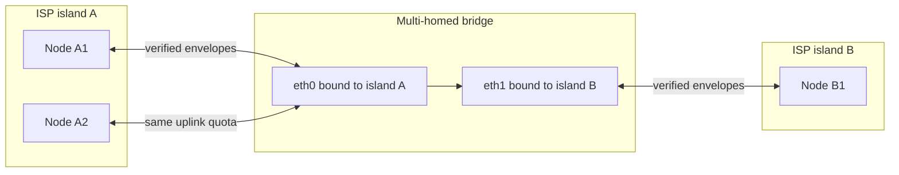
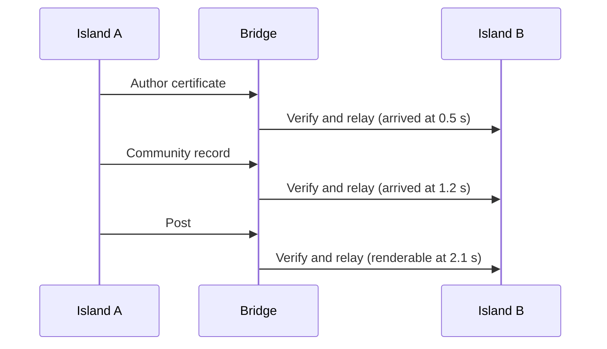
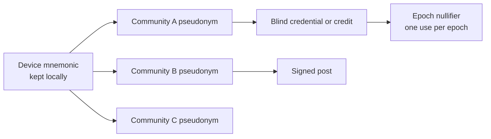

# Islands of Reach: system and project overview

Islands of Reach is a federated public forum designed for periods when a country loses access to
the global Internet but some domestic IP networks continue to operate. Independent people or
organisations can run forum servers. Users publish signed posts through one server, and the servers
exchange those posts without relying on a central platform. If domestic Internet service providers
become isolated from one another, an authorised server connected to both sides can act as a bridge.

The system aims to let people participate without registering an email address, phone number or
civil identity. Its current privacy guarantee is pseudonymity, not complete anonymity. A server or
network operator may still correlate IP addresses, timing, traffic volume, writing style and social
relationships.

The paper evaluates the Forum over surviving IP connectivity. The wider repository also includes
Tor access, an identified emergency-broadcast plane, encrypted messaging, LAN and WebRTC exchange,
portable offline bundles, and an optional Reticulum/LoRa adapter. Those capabilities are described
below, but they are not used as evidence for the paper's L0–L3 national-partition claim.

## 1. Problem being addressed

Most online forums depend on infrastructure outside the user's country. Even a federated platform
usually assumes that one server can reach another through the global Internet. Circumvention tools
such as Tor, Snowflake and decoy routing also need some working path to an external relay or service.

A national shutdown can fail in stages:

1. Traffic is throttled and connections become unreliable.
2. Selected sites, protocols, IP addresses or TLS names are blocked.
3. International transit is withdrawn.
4. Domestic peering is cut, leaving customers of different ISPs in separate network components.

The design starts with the connectivity that remains. A forum node inside an ISP can continue to
serve its local users. Nodes that can still reach one another continue to federate. A multi-homed
bridge can reconnect separate ISP components when it retains one working path into each side.

### Reachability model



This is a reachability model, not a promise that every shutdown leaves usable domestic paths. If all
links are cut, each component can store work and continue locally, but it cannot deliver to another
component until a path returns.

## 2. Main design goals

The project has five main goals:

- Keep public discussion available inside every surviving network component.
- Remove any single server's ability to alter a signed post without detection.
- Preserve evidence when a server acknowledges content and later hides or deletes it.
- Let each server apply its own visible moderation policy without changing protocol validity.
- Limit abuse without collecting civil identity.

The system does not promise global erasure, fair moderation, protection from a compromised device,
traffic-analysis resistance, elimination of Sybil identities or delivery when no network path
exists.

## 3. System architecture



The main components are:

| Component | Responsibility |
|---|---|
| Client | Creates keys, signs envelopes, queues writes, verifies receipts, stores audit certificates and displays provenance. |
| Forum server | Validates every envelope, updates read models, appends the transparency witness, returns a receipt and federates accepted objects. |
| Federation peer | Exchanges exact signed bytes, applies the same validation rules and requests resumable backfill after a gap. |
| Multi-homed bridge | A normal verifying server with approved cross-uplink relay policy. It does not bypass validation. |
| Audit-log server (ALS) | Independently verifies and retains proof that a server acknowledged a specific request. |
| Projection store | Holds views used for reading communities, posts, votes and moderation state. |
| Envelope and Merkle log | Holds the accepted event history and provides signed tree heads and inclusion proofs. |
| Anti-abuse services | Apply proof of work, credits, blind credentials, nullifiers, quotas and rate limits where required. |

No server is automatically trusted because it owns a domain name, has been manually approved or
belongs to the same deployment. Peer trust changes how much traffic a peer may send. It never makes
a signature, identifier or body check optional.

## Complete platform capabilities

The paper concentrates on the pseudonymous Forum, federation, the ALS and ISP bridging. The product
contains a second set of features for ordinary use and emergency communication. Both sets use the
same signed-envelope format and admission pipeline, but their identities, storage and privacy
expectations remain separate.

| Area | What the product provides | Important boundary |
|---|---|---|
| Forum | Communities, threaded posts and comments, votes, membership, search, attachments, profiles, follows, blocks, saved items, awards, notifications and pseudonymous direct messages. | A Forum key is a pseudonym, not proof of a civil identity. |
| Signal | Identified channels, ordered broadcasts, check-ins, missing-person and resource reports, and encrypted direct or group messages. | This plane is meant for recognisable organisations and people, not anonymous discussion. |
| Resilient delivery | Durable outbox, federation backfill, LAN discovery, WebRTC peer exchange and portable `.jbpack` files. | Store-and-forward preserves data; it cannot cross a physical partition without a carrier or link. |
| Access paths | Direct IP, ISP-local nodes, trusted reverse tunnels and Tor v3 onion services. | Each path has a different reachability and metadata threat model. |
| Optional radio adapter | A separate Reticulum sidecar can transport selected small, high-priority envelopes over LoRa or packet radio. | It is disabled by default, refuses bulk content and is outside the paper's evaluated claims. |

### Tor access

An operator can publish a node's local HTTP port as a Tor v3 onion service with the Linux or Windows
setup scripts in `ops/tor/`. The onion service gives the node a stable `.onion` address and protects
the connection inside Tor without requiring a public TLS reverse proxy. The backend should remain
bound to localhost when it is meant to be reachable only through Tor. The hidden-service directory
must be backed up securely because its private keys determine the stable onion address.

The mobile client accepts a typed or scanned onion address and automatically selects its embedded
Tor transport. An operator can also preconfigure `EXPO_PUBLIC_TOR_NODE_URL` and set
`EXPO_PUBLIC_NODE_TRANSPORT=tor`. Embedded Tor requires a native Android or iOS build; it is not
available in Expo Go. Server setup is exposed through `pnpm tor:linux` and `pnpm tor:windows`.

Tor is useful when direct access is filtered, when an operator cannot expose a public address, or
when a user wants to avoid revealing a direct IP address to the forum node. It does not guarantee
anonymity against traffic correlation, a compromised device or a global observer. It also cannot
carry traffic during a complete national disconnection unless a Tor-reachable path still exists.
For that reason, Tor complements the domestic-node design rather than replacing it.

### Separate Forum and Signal identities

The client derives the Forum and Signal planes from separate mnemonics and stores them in separate
vaults. Forum keys can be derived per community so activity in two communities does not expose the
same public key. Signal keys are attached to verifiable claims because a reader must recognise a
hospital, relief group, journalist or volunteer during a crisis. A Forum certificate cannot
authorise a Signal action, and a plane mismatch is rejected by the shared admission pipeline.

Each vault has its own lock and panic-wipe path. Wiping Forum data does not erase Signal data, and
the reverse is also true. This separation limits accidental linkage, although timing, device
compromise, writing style and network observation can still connect activity across the two planes.

### Broadcasts, crisis reports and encrypted messages

Signal channels use signed declarations, key rotation, retirement and vouches that clients can
verify themselves. Broadcasts have sequence numbers, allowing a client to notice a missing item
instead of silently accepting an incomplete stream. Revocations and corrections receive the
highest delivery priority. Subscriptions stay on the device; the server does not maintain a list of
who follows a sensitive channel.

Check-ins, missing-person reports and resource reports are small, high-priority messages. A check-in
costs no credits and requires no anonymous credential. The same plane supports offline-startable,
end-to-end encrypted messaging through published prekey bundles. Nodes retain ciphertext and the
routing metadata needed for delivery, while clients verify cached prekeys and their expiry before
use. The key-agreement design combines X25519 with ML-KEM-768 for captured-now, decrypted-later
protection; compact Ed25519 signatures are retained for individual messages.

### Offline and local exchange

The client assigns the final content identifier when it signs an envelope, even while offline. It
places those exact bytes in a durable, priority-ordered outbox and retries idempotently when any path
returns. A later receipt therefore refers to the same object the user created offline.

For nearby transfer, peers can pair by QR code or a copied code and exchange envelopes over a
WebRTC data channel. The local mesh frame adds reconciliation, hop, age and quota limits, but every
received envelope is still treated as untrusted and verified before storage. A `.jbpack` file offers
the same store-and-forward idea through removable media or another file-transfer method. Each
envelope is checked separately, so valid entries can be recovered from a partly damaged bundle.

The optional Reticulum service is a separate Python sidecar. It owns the radio state, fragmentation,
reassembly and durable radio queue. If the sidecar is absent or fails, Forum ingress, HTTP and normal
federation continue. Only small priority classes are eligible; bulk posts are rejected on that
transport. No claim in the current paper depends on this adapter or on LoRa availability.

### Discovery, attachments and client safety

A client can find a node through its retained peer directory, configured ISP seeds, mDNS/SSDP on a
local network, manual entry or a QR-encoded node address. Nodes behind CGNAT can initiate federation
connections outbound. A phone may reach an otherwise inaccessible node through an explicitly
trusted reverse-tunnel peer, and the interface shows that tunnel rather than concealing the change
in path.

Large attachments travel outside the signed envelope. The client uploads the bytes, the node checks
their hash, and the author signs a compact claim over that hash. Filesystem and S3-compatible blob
adapters implement the same flow.

The client exposes the current reachability scope and provenance instead of presenting all data as
equally fresh or independently witnessed. It also provides separate vault locks and panic wipes,
battery and data-saver controls for relaying, and Bangla and English interface support. These safety
controls reduce accidental exposure and resource use; they cannot protect an already unlocked,
compromised device.

## 4. The signed envelope

Every write uses one structure called an envelope. Posts, comments, votes, moderation actions,
tombstones, key revocations and broadcasts enter through the same write endpoint.

An envelope contains a protocol version, domain, identity plane, author public key, timestamp,
priority, body and signature. The identifier is computed from the canonical bytes of the signed
fields:

```text
content_id = base32(sha256(canonical_signed_fields))
```

The Ed25519 signature covers the same bytes. This gives every honest implementation the same answer
for the object's identity. A server cannot edit the body, author, timestamp or priority while
keeping the original identifier and signature valid.

Protobuf permits more than one byte representation for the same parsed message. The project
therefore defines one accepted encoding. A receiver parses the submitted bytes, re-encodes the
message and rejects it if the two byte strings differ. It then verifies the signature against the
bytes that arrived. The receiver never repairs malformed input and then treats the repaired form as
authentic.

TypeScript, Rust and Python implementations agree byte for byte on all sixteen conformance vectors.

## 5. The nineteen-step admission pipeline

Every local or federated envelope goes through the same ordered pipeline.



| Step | Check or action | Purpose |
|---:|---|---|
| 1 | Raw size | Reject oversized input before parsing or allocation grows. |
| 2 | Canonical parse | Reject malformed encoding and unknown fields. |
| 3 | Version | Refuse unsupported protocol versions. |
| 4 | Domain | Select the exact message type and its rules. |
| 5 | Identity plane | Keep Forum and other identity contexts separated. |
| 6 | Algorithm policy | Refuse signing algorithms not allowed for that domain. |
| 7 | Priority | Check that the message may use the requested traffic class. |
| 8 | Clock | Enforce the configured timestamp window. |
| 9 | Signature | Verify that the named author signed the received bytes. |
| 10 | Certificate | Verify the author's certificate when the domain requires one. |
| 11 | Deduplication | Refuse a content identifier already admitted in that direction. |
| 12 | Replay | Refuse a nonce or event that has already been consumed. |
| 13 | Anti-abuse | Charge proof of work, credits or anonymous credentials. |
| 14 | Authorisation | Check roles and domain-specific permission. |
| 15 | Body validation | Check the meaning and references inside the payload. |
| 16 | Apply | Update the relevant read projection. |
| 17 | Witness | Append the same accepted envelope to the Merkle log. |
| 18 | Receipt | Return the node's signed acknowledgement and proof material. |
| 19 | Fanout | Queue the accepted envelope for federation and auxiliary services. |

Steps 1 through 12 perform no database writes. This prevents malformed traffic from turning into a
database-write flood. Steps 16 and 17 run in one transaction, so a post cannot become visible in a
projection without a matching witness entry.

A receiving federation node repeats every applicable step. Step 13 is the only exception. Admission
cost is tied to the origin server's secrets and is paid once at the origin. The receiving node uses
peer quotas and backpressure instead of trying to charge the same origin-specific proof again.

## 6. Write and audit-log workflow

The ALS is not placed between the user and the forum server. It receives a proof bundle only after
the forum server has accepted the write.



### 6.1 What the client saves

Before sending, the client places the final signed request in a durable outbox. After acceptance,
the node returns a signed receipt containing the content and server identities, acceptance and leaf
positions, a signed tree head and a Merkle inclusion proof.

The client combines that receipt with the exact UTF-8 HTTP request body, method, path and content
type. The resulting audit certificate is saved on the device before the client contacts an external
service. This order closes a failure window: if the network disappears after acceptance, the proof
still exists locally and forwarding can resume later.

### 6.2 What an ALS checks

For each submitted certificate, an ALS:

1. decodes the original envelope;
2. enforces canonical encoding;
3. recomputes the content and server identifiers;
4. verifies the receipt and signed tree head;
5. verifies that the inclusion proof covers the accepted content; and
6. appends the verified certificate to a JSONL hash chain.

An exact retry is idempotent. A conflicting certificate for the same `(server_id, content_id)` pair
is rejected. Provenance issue reports use a separate hash-chained stream so a report cannot be
confused with proof of acceptance.

### 6.3 Current status and prior acknowledgement

Later, the client can present the certificate to the issuing node's `/status` endpoint. The node may
answer `online`, `hidden`, `deleted` or `unknown_server`. The ALS does not answer this live-status
question. Its job is to preserve the earlier acknowledgement.

This distinction matters:

- the author's signature proves what bytes the author signed;
- the node receipt proves that the node acknowledged those bytes;
- an ALS preserves an independently checked copy of that acknowledgement;
- the issuing node reports its current view of the content.

The certificate does not prove that an unacknowledged request was accepted. It cannot force a node
to continue serving a body, and it cannot recover content after every client, peer and auditor copy
has disappeared. Direct-message certificates stay on the client because forwarding them would
create a timestamped social graph.

## 7. Federation between independent servers

Federation is server to server. Operators decide which peers their node uses. Clients connect to a
chosen home server and may later change it.

Four rules prevent federation from weakening local verification:

1. Peer bytes are passed through unchanged. The network adapter does not re-encode them.
2. Trust controls quota and priority, never validity.
3. Deduplication is enforced by a database uniqueness constraint rather than a read-then-write race.
4. A received envelope is not sent straight back to the peer that supplied it.

Content identifiers used by federated payloads must be derivable from signed bytes. A node-local
identifier would cause two servers to project the same signed event under different names.

Nodes keep durable outbound queues. They stream recent work while connected and use resumable
backfill after disconnection. A node behind carrier-grade NAT can still participate in both
directions: it sends queued work over a connection it opens and requests inbound history over that
same outbound reachability. A reverse tunnel through a trusted peer is available when deployment
policy permits it.

## 8. Transparency and fork detection

Each accepted envelope is appended to a Merkle tree. The server signs tree heads containing the
tree size, root and timestamp. Peers gossip these heads.

A smaller tree head may indicate that a server rewrote history, but observations can arrive out of
order. The implementation therefore compares signed timestamps before treating a smaller size as a
rollback:

```text
if incoming.timestamp < recorded.timestamp:
    return UNKNOWN and do not record the stale observation
else if incoming.tree_size < recorded.tree_size:
    return FORKED
else:
    record the incoming head and return OK
```

This rule avoids falsely blocking an honest peer when an older observation arrives late. It is not
a replacement for a Merkle consistency proof. When the peer is reachable, the node should obtain
that proof. Detection also assumes that at least one honest observer exchanges a conflicting head;
a colluding or eclipsed peer neighbourhood can maintain a false view.

## 9. ISP availability and bridging

The ISP work is separate from the nineteen admission steps. It is a twenty-two-task availability
programme covering path selection, discovery, bridging, NAT reachability and operator/client
surfaces.



The direct exchange route between the islands is removed in the testbed. The only remaining path is
through the bridge. Each federation socket is bound to the source address of the appropriate uplink,
and the container gate confirms the actual socket addresses.

### 9.1 The twenty-two ISP tasks

| Task | Function |
|---|---|
| T3.1 | Carry reachability scope through endpoint, peer and uplink records. |
| T3.2 | Track each uplink as up, degraded, down or unknown. |
| T3.3 | Bind outbound federation sockets to the chosen uplink source address. |
| T3.4 | Select the narrowest working scope and prefer the same autonomous system. |
| T3.5 | Apply jittered endpoint backoff capped at five minutes. |
| T3.6 | Retain a durable client peer directory. |
| T3.7 | Provide per-ISP seed entries for cold-start discovery. |
| T3.8 | Run a container topology with separate ISP islands and a removable exchange path. |
| T3.9 | Support federation inside one ISP when global reach is absent. |
| T3.10 | Record attempts, success and latency by reachability scope. |
| T3.11 | Apply bridge-pair policy, relay decisions and loop prevention. |
| T3.12 | Enforce quota per uplink pair and traffic class. |
| T3.13 | Re-evaluate peer paths after an uplink change. |
| T3.14 | Re-announce and request backfill after a path switch. |
| T3.15 | Attempt UPnP-IGD or NAT-PMP mapping and continue outbound-only if it fails. |
| T3.16 | Discover reflexive addresses and detect carrier-grade NAT. |
| T3.17 | Allow a reverse tunnel through a trusted peer. |
| T3.18 | Discover nearby nodes through mDNS or SSDP. |
| T3.19 | Accept manual node addresses and QR-assisted entry in the client workflow. |
| T3.20 | Keep the current reachability scope visible in the client. |
| T3.21 | Expose bridge readiness and state to the operator. |
| T3.22 | Provide Bangla and English router port-forwarding guidance. |

The implementation contains the core path, bridge, discovery, NAT and client-scope mechanisms. The
container gate passed all 19 deployment checks on 19 August 2026. The standalone router guide named
by T3.22 is still absent from `ops/docs` and should be completed before a field deployment.

### 9.2 Bridge policy

A bridge relays only across configured uplink pairs. It must have a trusted peer on both sides.
Packets still pass the ordinary admission pipeline. The bridge quota is charged once per uplink pair,
not once per destination peer, because several peers on one island share the same constrained link.

Bulk forum traffic can use at most half of the bridge grant. The remaining capacity is reserved for
higher-priority classes so a backlog cannot consume the full crossing. If one uplink changes state,
the node re-evaluates active paths, reconnects, re-announces and backfills missing content.

### 9.3 What crosses for one visible post



A post cannot be rendered on the far island until its author certificate and community record are
present. The measured crossing therefore reports all three arrivals rather than only the post event.

The first deployment took 407.6 seconds because a serial drain waited indefinitely on a blackholed
peer before trying the bridge. Concurrent per-peer drains with deadlines reduced the crossing to
2.1 seconds. This failure showed that multi-homing is ineffective when one unavailable peer can block
all other deliveries.

## 10. Identity and anti-abuse

Forum identity is based on keys rather than an account database. A device mnemonic derives separate
keys for separate communities. The device keeps the root material and does not transmit it.



The server does not need an email address, password or civil identity. It is also forbidden to
persist a direct IP-address-to-Forum-key mapping. Separate pseudonyms reduce simple account linking,
but they do not defeat a network observer, key reuse, stylometry, repeated contacts, posting times or
identifying attachments.

Abuse is priced rather than tied to identity. Depending on the action, the server can require
memory-hard proof of work, credits, blind credentials or an epoch nullifier. Federation peers also
have per-class quotas. These controls bound the rate of abuse. They do not limit the number of keys
an attacker can create, and proof of work may disadvantage low-power devices and people with limited
electricity.

Optional Tor can hide an IP address while an external Tor path remains reachable. It is not a remedy
for a shutdown that removes that path.

## 11. Moderation and deletion

Content becomes cryptographically valid when the author signs it. A server does not make a post
valid by approving it. Moderation is a separate signed action that may hide, label or otherwise
classify an existing object under one server's policy.

Each server can publish its moderation rules, reasons, role changes and reports. A deletion leaves a
signed tombstone rather than silently rewriting the accepted history. Users can choose a server with
a different policy and continue reading content received through federation.

Transparency does not make a decision fair. A server can defederate, a moderator group can be
captured, a dominant client can choose one label source by default, and volunteers can burn out.
Replication also creates a real conflict with privacy and safety: personal, illegal or dangerous
material may survive after a victim asks for removal. The protocol has no global appeal court or
global erasure mechanism.

## 12. Threat model

The adversary may control national or ISP routing, block by DNS, IP or SNI, throttle selected traffic,
observe links it carries, run malicious federation peers, coerce a server operator, flood the system
or seize a user's device. The design assumes that Ed25519 and SHA-256 remain secure, uncompromised
devices keep their signing keys, the adversary is not a global passive observer and at least one
honest peer or auditor remains where independent observation is required.

| Threat | Defence in the design | Remaining risk |
|---|---|---|
| Server edits a post | Author signature, canonical bytes and content-derived ID | The server can omit or serve an older valid object. |
| Server deletes acknowledged content | Client receipt, Merkle proof, federation copies and independent ALS copies | Evidence exists only after acknowledgement and while some copy survives. |
| Shadowban or selective omission | Author-valid objects, signed moderation and ability to change server | No protocol proves that one read API returned every valid object. |
| Relay tampering | Exact-byte federation and repeated verification | A relay can delay, reorder or omit valid objects. |
| History rewrite or split view | Atomic witness append and signed tree-head gossip | Honest observation and, when possible, a consistency proof are still needed. |
| Malicious peer flood | Full admission checks, replay protection, quotas and backpressure | CPU, sockets, bandwidth and valid-work floods remain possible. |
| National or ISP partition | Local operation, scoped path selection, durable queues and bridges | Domestic IP paths, reachable nodes and a bridge between isolated islands must exist. |
| Direct blocking or hidden node | Tor v3 onion service, manual/QR addresses and an optional trusted reverse tunnel | Tor still needs a reachable Tor path; a tunnel peer sees the carried request; traffic correlation remains possible. |
| Bridge capture or failure | Independent verification, opt-in pairs, quota and possible bridge replication | One deployed bridge is still a chokepoint and metadata observer. |
| CGNAT | Outbound drain, requested backfill and optional trusted reverse tunnel | Bootstrap peers and tunnel providers become dependencies. |
| Eclipse or poisoned discovery | Retained seeds, probation and vouching | The system does not prove that a node's peer set is diverse. |
| Spam and Sybil identities | Posting cost, blind credentials, nullifiers and quotas | Cost limits rate rather than identities or coordinated people. |
| Deanonymisation | No civil identity, separate keys and no persistent IP-key map | Timing, network metadata, writing style, attachments and social graphs remain linkable. |
| Device compromise | Key separation and revocation limit some later damage | An unlocked compromised device exposes keys and drafts. |
| Disinformation | Signatures attribute statements to keys; labels permit counterspeech | A correctly signed statement can still be false. |
| Client or seed-list capture | Users can change servers and retain signed content | A dominant app, store, seed set or label provider can become a censor. |
| Legal and operational pressure | Independent operators and portable evidence distribute control | Hosting, moderation, transit and legal defence cost money and may reconcentrate operation. |

The most accurate claim is that the project provides pseudonymous participation, server-independent
integrity, portable evidence and measured domestic IP reach across a simulated ISP partition. It is
not "censorship proof" and does not provide sender anonymity against network observers.

## 13. Evaluation and results

The evaluation uses several configurations because each answers a different question.

| Test | Result | What it supports |
|---|---|---|
| Canonical encoding | TypeScript, Rust and Python agree on 16/16 vectors | Independent implementations identify and sign the same bytes. |
| Two-node federation | Identical post and community identifiers across independent datastores | Signed identifiers do not depend on the receiving node. |
| Projection rebuild | Every populated collection reproduced byte for byte from the envelope log | The log is sufficient to rebuild read state. |
| Federation suite | 31 assertions across admission, quota, streaming, backfill, fork detection and directory exchange | Main peer behaviours are covered in tests. |
| Eight-node chain | 200/200 posts reached hop 7; median 4.125 s and p99 6.115 s | Paced multi-hop propagation had zero loss. |
| ISP container gate | 19/19 checks passed | The isolated-island topology, source binding, bridge policy, quota and failover worked together. |
| Cut-path crossing | Author certificate 0.5 s, community 1.2 s, post 2.1 s | A renderable post crossed after the direct exchange route was removed. |
| Healthy-path crossing | 1.5 s, 1.5 s and 1.9 s for the same dependency chain | Once selected, the bridge path was comparable to the healthy path in this testbed. |
| Invalid-envelope flood | 3,000 requests at concurrency 16; 730 req/s; zero database writes | Invalid input did not amplify into database writes. |
| Flood rejection stage | 90% stopped by the peer rate limiter; 9% reached signature verification | Rate limiting was the first defence and the no-write prefix was the second. |
| Read path | Peak 750 req/s at concurrency 8 | The local read API sustained the measured load. |
| Memory | 62 MiB idle node, 233 MiB under crossing, about 384 MiB for node, database and cache | The stack fits within a 512 MB target, with storage as the tighter constraint. |
| Wire size | 155 B check-in, 220 B post, 243 B Bangla broadcast | Signed fixed-schema objects remain small. |
| ActivityPub sample | Raw overhead 19.5 to 25.9 times larger; gzipped overhead 4.4 to 6.9 times larger | The fixed schema saves link bytes but gives up JSON-LD extensibility. |

These are laboratory results. The ISP topology uses containers on one host, so clocks are aligned,
networks are virtual and physical routing policy is simulated. The project has not yet completed a
multi-operator field trial during real interference.

## 14. Relationship to earlier systems

| System family | Useful prior idea | Difference in this project |
|---|---|---|
| Publius, Freenet, Tangler | Replication and host-takedown resistance | Their readers still need routes to the replicas; this project studies surviving domestic components. |
| Tor, Snowflake, Telex | Censorship circumvention | They require some path outside the censor and do not cover a complete international transit cut. |
| Netnews/Usenet | Independent servers, public groups, retry and local policy | Its base format does not authenticate authors or provide the same receipt and bridge design. |
| ActivityPub | Widely deployed server federation | Signed stored objects and scope-aware bridging are not mandatory parts of the protocol. |
| Matrix | Signed events and canonical JSON | Its room and server model has different reachability and history assumptions. |
| AT Protocol | Signed repository commits and deterministic encoding | Current identity-to-key resolution depends on an external directory. |
| Nostr | Author-signed events and client-selected relays | Base Nostr has no required relay-to-relay exchange. |
| Secure Scuttlebutt | Author-signed append-only feeds and local discovery | It is stronger for infrastructure-free local replication but has different anonymity and ISP-bridge goals. |
| Certificate Transparency | Merkle logs, signed tree heads and consistency proofs | The project applies these ideas to accepted forum events and handles stale observations during a network partition. |

No individual mechanism is new by itself. The work lies in combining signed public discussion,
outbound-only federation, portable acknowledgement evidence and scoped multi-ISP reach, then testing
the combined system under a severed exchange route.

## 15. Repository structure

| Path | Contents |
|---|---|
| `backend/src/core/` | Domain rules, ports, envelope admission and Merkle logic. |
| `backend/src/adapters/` | MongoDB, Redis, filesystem/S3, HTTP and transport integrations. |
| `backend/src/features/` | Forum and other feature handlers built on the core write path. |
| `backend/src/transport/isp.e2e.spec.ts` | In-process ISP availability and bridging tests. |
| `frontend/` | Expo client, signing, durable outbox, provenance display, scope UI and service discovery. |
| `packages/sdk-ts/` | Canonical encoding, identifiers, signatures, audit-certificate verification and generated contracts. |
| `crates/jb-core/` | Rust implementation used for cross-language agreement. |
| `services/audit-log/` | Independent certificate verifier and append-only JSONL hash-chain service. |
| `proto/` | Protocol definitions and registries. Generated files should not be edited by hand. |
| `tools/vectors/` | Cross-language conformance fixtures. |
| `ops/isp-compose.yml` | Four-node, two-island and multi-homed bridge testbed. |
| `paper/` | Paper, figure catalog, presentation and their source files. |
| `Plans/` and `Code Implementation/` | Requirements, architecture decisions, threat audits, research notes and implementation history. |

The backend follows a hexagonal structure. Core code depends on ports rather than MongoDB, Redis,
HTTP or a specific transport. Adapters implement those ports. This keeps the security rules in one
place and lets tests replace infrastructure without changing the domain logic.

The complete-platform section explains how the Signal, Tor, mesh, offline-bundle and optional radio
modules relate to the narrower Forum contribution evaluated in the paper.

## 16. Building and checking the project

The main workspace commands are:

```bash
pnpm install --frozen-lockfile
pnpm build
pnpm lint
pnpm typecheck
pnpm test
pnpm proto:check
pnpm vectors
pnpm smoke:local
```

For the local infrastructure and the ISP testbed:

```bash
pnpm local:up
pnpm ops:isp
pnpm gate:isp
```

The paper can be rebuilt from `paper/main.tex`. The presentation is reproducible with:

```bash
python paper/build_presentation.py
```

The proposal PDF is generated directly from this Markdown through the VS Code preview renderer:

```bash
node tools/build_proposal_from_md.mjs
```

## 17. Work still needed

The next phase should concentrate on evidence that a single-host container setup cannot provide:

1. Run nodes under different operators, clocks and physical ISPs.
2. Test redundant bridges so one bridge is not the only cross-island chokepoint.
3. Measure directory poisoning, eclipse attempts, certificate expiry, clock drift, slow peers and
   valid-envelope floods.
4. Test whether users understand the reachability indicator, evidence status and server-switching
   flow during a stressful outage.
5. Complete the Bangla and English port-forwarding guide required by T3.22.
6. Establish reproducible client builds and transparent update distribution.
7. Define governance for default seeds, audit services, label providers, appeals and harmful-content
   handling.
8. Measure the financial and moderation cost of keeping independent nodes and bridges operating.

## 18. Terminology

| Term | Meaning in this project |
|---|---|
| Envelope | The canonical signed object used for every write. |
| Projection | A read-friendly view derived from accepted envelopes. |
| Witness or Merkle log | Append-only accepted-event history used for inclusion and fork evidence. |
| Signed tree head | A signed summary containing a Merkle root, size and timestamp. |
| Audit certificate | The exact request plus the node's signed receipt and proof material. |
| ALS | An independently run audit-log server that verifies and retains audit certificates. |
| Federation | Server-to-server exchange of exact signed envelopes. |
| Backfill | A resumable request for objects missed during a disconnection. |
| ISP island | A reachable component inside one ISP that cannot route directly to another component. |
| Bridge | A verifying multi-homed node authorised to relay across an uplink pair. |
| Pseudonymity | Participation through public keys without civil identity; it does not imply traffic anonymity. |
| Tombstone | A signed record that content was removed or hidden under a policy. |

## 19. Companion material

- [Printable project overview](proposal.pdf)
- [Main paper](paper/main.pdf)
- [Large-format figure catalog](paper/figures-draft.pdf)
- [Presentation](paper/Islands-of-Reach-Presentation.pptx)
- [Presentation handout](paper/Islands-of-Reach-Presentation.pdf)
- [Threat-model audit](Code%20Implementation/NSYSS-2026-THREAT-MODEL-AUDIT.md)
- [Censorship-resistance literature audit](Code%20Implementation/NSYSS-2026-CENSORSHIP-RESISTANCE-SOURCES.md)
- [Portable audit-certificate decision](Code%20Implementation/ADR-009-PORTABLE-AUDIT-CERTIFICATES.md)
- [ISP availability plan](Code%20Implementation/P3-ISP-AVAILABILITY-PLAN.md)
- [Build and measurement history](Code%20Implementation/BUILD-LOG.md)
