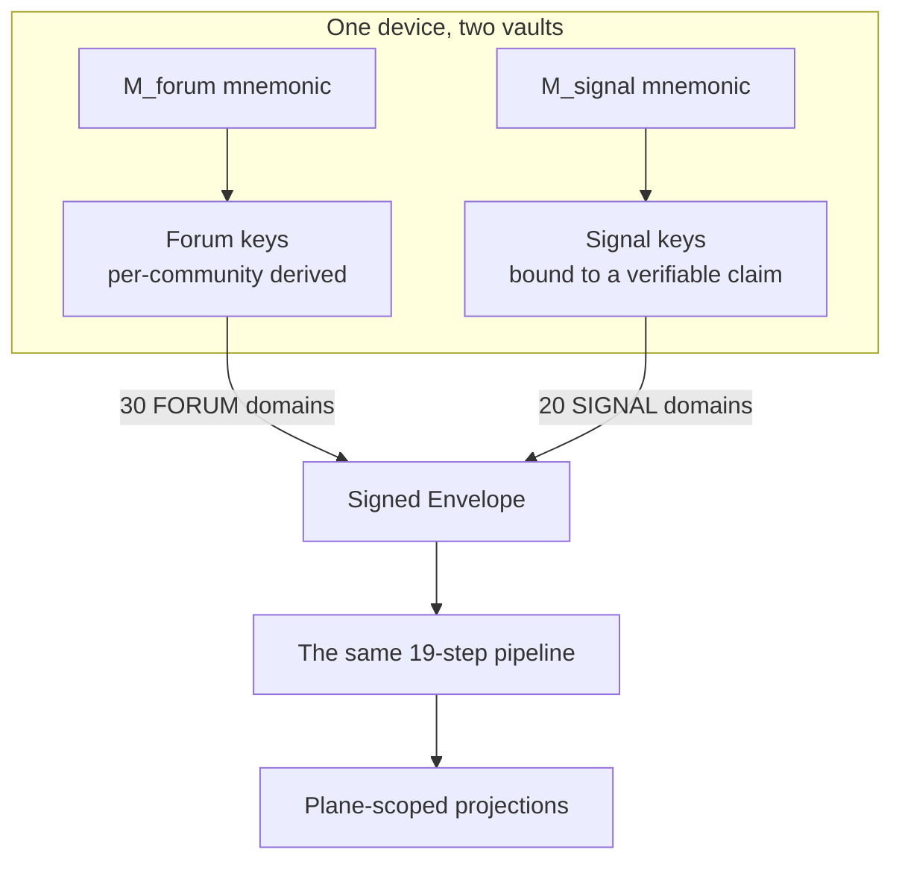
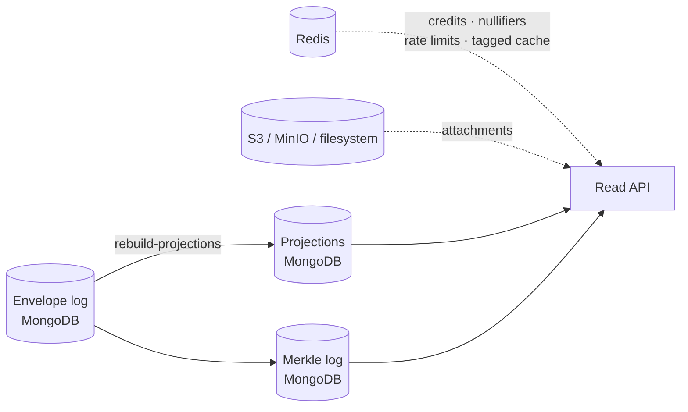
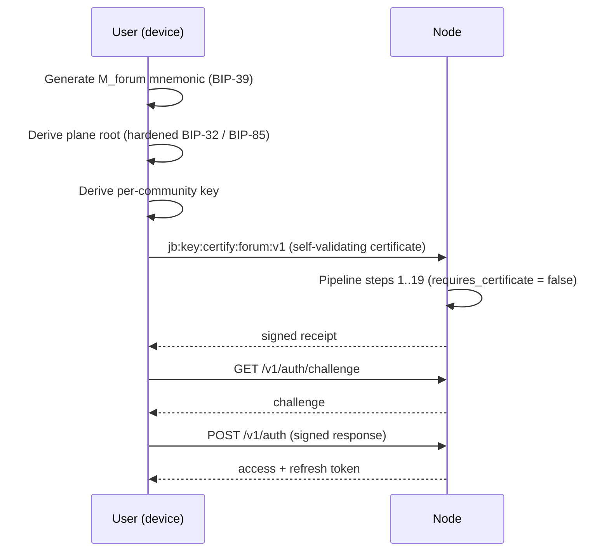
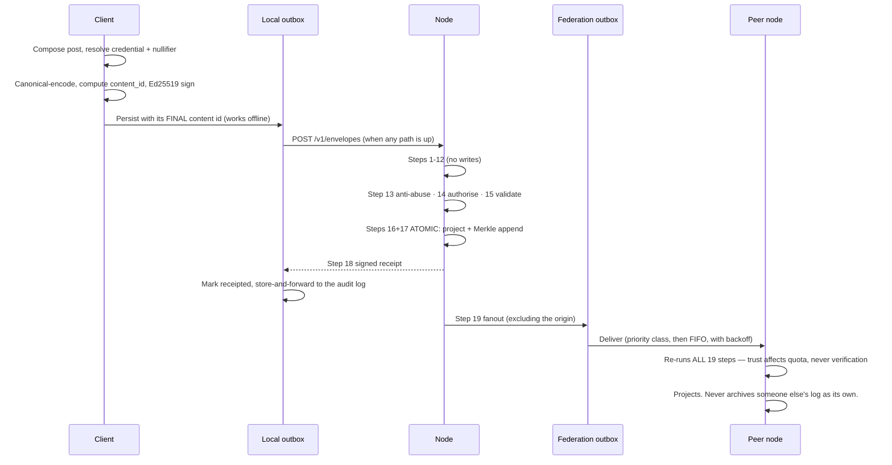
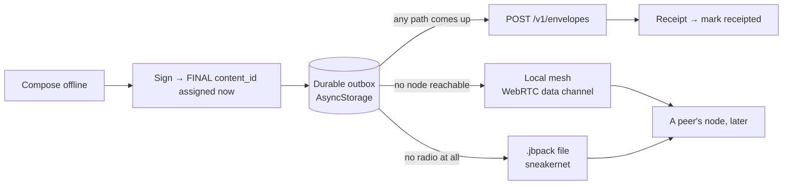
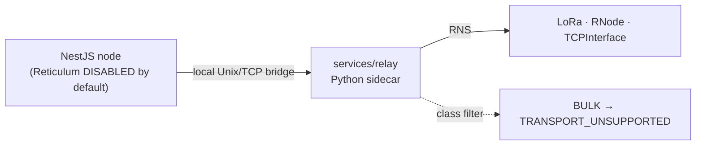
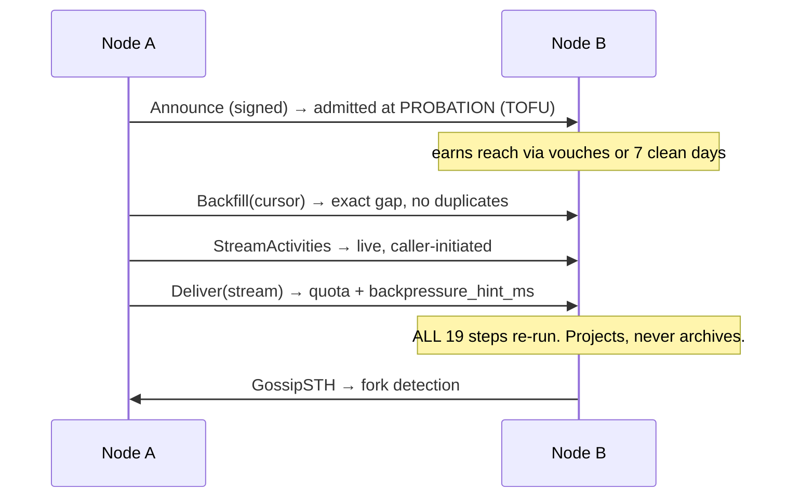

# Jagoo Bahee v2

A **federated, censorship-resistant community platform** that degrades gracefully from full
internet, through ISP-level blocking, to a complete national blackout — and keeps working at every
step.

The Forum scope and the wider platform, including Tor, Signal, offline transfer, audit-log workflow,
threat model, diagrams and measured results, are documented in
[PROJECT-OVERVIEW.md](PROJECT-OVERVIEW.md). A printable version is available as
[proposal.pdf](proposal.pdf).

It looks like a forum: communities, posts, threaded comments, votes, moderation, messaging.
Underneath, **every mutation is a self-authenticating signed envelope** whose validity does not
depend on any server. That single property is what lets the same content travel over HTTP, gRPC,
LoRa, Bluetooth, or a QR code photographed off a stranger's screen, and still be verified on
arrival.

Alongside it runs a second, deliberately **unlinkable** system: identified broadcast channels and
person-to-person messaging, where knowing exactly *who* is speaking is the entire point.

> New here? **[Installation.md](Installation.md)** gets you running. **[Testing.md](Testing.md)**
> explains what every test proves. This document explains how the system works.

---

## Contents

- [1. The two tracks](#1-the-two-tracks)
- [2. Foundations both tracks stand on](#2-foundations-both-tracks-stand-on)
- [3. Track 1 — Forum](#3-track-1--forum)
- [4. Track 2 — Broadcast and offline messaging](#4-track-2--broadcast-and-offline-messaging)
- [5. The resilience ladder](#5-the-resilience-ladder)
- [6. Federation](#6-federation)
- [7. The client](#7-the-client)
- [8. Repository map](#8-repository-map)
- [9. Design decisions that look wrong until you know the context](#9-design-decisions-that-look-wrong-until-you-know-the-context)

---

## 1. The two tracks

| | **Track 1 — Forum** | **Track 2 — Broadcast & offline messaging** |
| --- | --- | --- |
| **Identity plane** | `FORUM` (Plane A) — pseudonymous | `SIGNAL` (Plane B) — identified |
| **Root secret** | `M_forum` mnemonic | **separate** `M_signal` mnemonic |
| **The point is** | You cannot tell who said it | You can tell *exactly* who said it |
| **Contents** | Communities, posts, comments, votes, moderation, roles, labels, awards, attachments, pseudonymous DMs | Channels, broadcasts, crisis check-ins, missing-person and resource reports, identified E2EE messaging, groups |
| **Registry domains** | 30 | 20 |
| **Transport class** | Bulk — unbounded, yields | Priority — small, floods first |
| **Size budget** | none | ≤ 512 B broadcast / ≤ 1 KB direct / ≤ 512 B check-in, **after** encoding |
| **Anti-abuse** | Credits, blind credentials, epoch nullifiers, PoW | Certificate + channel trust; a check-in costs **zero** |
| **Degrades to** | Local mesh, `.jbpack` sneakernet | LoRa / packet radio |

### Why they are separated, and why nothing may join them

If a person's known broadcast identity were linkable to their forum identity, then publishing under
their real name as a relief coordinator would **retroactively deanonymise every forum post that key
ever made** — including posts written years earlier under an assumption of anonymity.

So the separation is enforced structurally, not by policy:

- Two independent mnemonics. Two independent key hierarchies. Two independent vaults on the device.
- Every registry domain belongs to **exactly one** plane. An envelope whose domain plane disagrees
  with its plane field is rejected at pipeline step 5 with `PLANE_MISMATCH`.
- Certificates, revocations and projections are plane-scoped. A Forum certificate cannot authorise a
  Signal envelope.
- Separate SSE streams (`/v1/events`, `/v1/events/signal`), with one-plane-per-stream asserted in
  tests.
- Separate panic wipes: destroying the Forum vault leaves the Signal vault intact, and vice versa.
- **The UI must never offer plane linkage.** No screen publishes both identities together,
  cross-links profiles, or imports one plane's contacts into the other. If a user asks for it, the
  app explains the risk and declines.



They share exactly one thing: the envelope, and the pipeline that validates it. Everything else is
separate by construction.

---

## 2. Foundations both tracks stand on

### 2.1 There is exactly one write endpoint

```
POST /v1/envelopes
```

A post, a vote, a ban, a broadcast, a private message, a key revocation — all of it is an
`Envelope`. **No feature may add a write route.** If a feature appears to need one, either its
registry row or its body schema is wrong.

This is why the system federates at all. A server with a hundred write endpoints has a hundred
places where validation can differ; a server with one has one pipeline, and any peer can re-run it.

### 2.2 An envelope is self-authenticating

```
content_id = "jb1" + base32-nopad-lower( SHA-256( canonical_bytes(fields 1..12) ) )
signature  = Ed25519 over the same canonical bytes
```

**Canonical encoding is deterministic protobuf**: ascending field number, zero values omitted, no
retained unknown fields, NFC-normalised strings, and **no floats anywhere in a signed structure**.
There is exactly one accepted form per version. Fallback chains and "try the legacy shape too" are
forbidden — that ambiguity is the v1 signature-confusion bug this rebuild exists to foreclose.

Three independent implementations (TypeScript, Rust, Python) are compared byte-for-byte in CI. See
[Testing.md §2](Testing.md#2--the-cross-language-canonical-gate).

Consequences worth stating plainly:

- The content ID is derived from the content, so **any node computes the same ID** for the same
  envelope. Nothing is keyed on a database row.
- Validity is established by the signature, not by which server it arrived from. A post handed to
  you on a USB stick is exactly as valid as one fetched over TLS.
- Deduplication is free and global.

### 2.3 The 19-step validation pipeline

Every envelope, from every transport — HTTP, gRPC federation, local mesh, Reticulum — runs the
**same pipeline in the same order**. Peer trust affects quota only, never verification.

| # | Step | What it does |
| --: | --- | --- |
| 1 | `SIZE` | Reject before parsing anything |
| 2 | `PARSE` | Decode, then **re-encode and compare** — this is what establishes canonicality |
| 3 | `VERSION` | Known envelope version only |
| 4 | `DOMAIN` | Present in the registry, or `UNKNOWN_DOMAIN` |
| 5 | `PLANE` | Envelope plane must equal the domain's registry plane |
| 6 | `ALG POLICY` | Signature algorithm permitted for this domain |
| 7 | `PRIORITY` | Priority must equal the registry row's class |
| 8 | `CLOCK` | Timestamp inside the accepted window |
| 9 | `SIGNATURE` | Ed25519 over the canonical bytes |
| 10 | `CERTIFICATE` | Signing key certified, not revoked, correct plane |
| 11 | `DEDUPE` | Already seen? Unique index on `(content_id, direction)` |
| 12 | `REPLAY` | Nonce check for non-idempotent domains |
| 13 | `ANTI-ABUSE` | Credits, credential, nullifier, PoW — **first step allowed to mutate state** |
| 14 | `AUTHORISE` | Permission checked against current projections |
| 15 | `BODY VALIDATE` | The domain handler's pure validator |
| 16 | `APPLY` | Project into read models |
| 17 | `WITNESS` | Append to the Merkle transparency log |
| 18 | `RECEIPT` | Sign and return the acknowledgement |
| 19 | `FANOUT` | Notifications, SSE, federation outbox |

Two invariants the ordering exists to protect:

- **Steps 1–12 perform no database writes.** A flood of invalid envelopes cannot be amplified into
  write load. The cheap, purely computational checks run first, on purpose.
- **Steps 16 and 17 are atomic with respect to each other.** They share one Mongo transaction and
  roll back together. A projected envelope missing from the Merkle log is a transparency failure,
  not a minor inconsistency. This is why Mongo must run as a replica set even single-node.

Every step is an independently unit-testable pure function. `backend/src/core/app/ingress.ts`
**composes** them and does nothing else — there is no branch on `domain` anywhere in it.

### 2.4 The registry is the extension point

`proto/jagoo/v1/registry.yaml` is the only place a domain is defined. Each row maps a domain string
(`jb:post:create:v1`) to:

| Field | Meaning |
| --- | --- |
| `plane` | `FORUM` or `SIGNAL` — bound here, enforced at step 5 |
| `body` | Fully-qualified proto message name |
| `priority` | Must equal the envelope's priority (step 7) |
| `idempotent` | `false` ⇒ nonce required and replay-checked (step 12) |
| `scope_kind` | `COMMUNITY` \| `CHANNEL` \| `NONE` — what `envelope.scope` means |
| `key_algs` | Permitted signature algorithms (step 6) |
| `max_bytes` | Hard ceiling for the whole envelope (step 1) |
| `credit_cost` | Charged at step 13; `0` = free |
| `requires` | `CREDENTIAL` \| `NULLIFIER` \| `POW` |
| `requires_certificate` | Defaults true; false only for self-validating key certificates |
| `federate` | Defaults true; false keeps node-local privacy projections local |
| `permission` | Checked at step 14 against current projections |

It generates into TypeScript, Rust and Python. **Adding a feature adds a row plus a handler**, never
a branch in the pipeline:

```ts
interface DomainHandler<TBody> {
  readonly domain: string;
  readonly plane: Plane;
  validate(body, env): ValidationResult;              // pure, no I/O
  authorize(body, env, ctx): Promise<AuthDecision>;   // against projections
  project(body, env, tx): Promise<void>;              // same transaction as the log append
  afterCommit?(body, env): Promise<void>;             // notifications, fanout hints
}
```

A `switch` or `if` on `domain` anywhere in the core is banned and lint-enforced. If one appears, the
Open/Closed abstraction has failed.

### 2.5 Storage — and what is actually precious



**The envelope store is the only backup-critical dataset.** Projections are derived and must be
fully reconstructible by `rebuild-projections`, **byte-identically**. If a projection cannot be
rebuilt from the envelope log alone, that is a defect in the handler, not a reason to start backing
up projections. Federation state — the direction ledger, peer directory, outbox, cursors — is
derived too.

Performance rules that are not negotiable, because each was a v1 failure:

- Every list endpoint is **cursor-paginated**. Offset pagination does not exist here.
- Cache invalidation uses **tagged keys**. A keyspace `SCAN` per write is a load amplifier that gets
  worse exactly as the instance gets busier.
- Every counter or balance mutation is **one atomic Redis Lua script**. Read-modify-write and
  `INCR`-then-`PEXPIRE` are both forbidden.
- Outbound queues are ordered by **priority class first, then FIFO**. A queued emergency broadcast
  overtakes 500 queued votes.
- The node must run on a **Raspberry Pi 4 in under 512 MB RAM**. That is a design constraint, not a
  target.

### 2.6 Transparency — the node cannot lie quietly

Every accepted envelope is appended to a **Merkle transparency log** in the same transaction that
projects it. The node then returns a **signed receipt**.

```
POST /v1/envelopes            → signed receipt (content id, leaf index, tree head, node signature)
GET  /v1/receipts/:contentId  → the receipt again
GET  /v1/log/inclusion/:id    → inclusion proof: this envelope is in that tree
GET  /v1/log/consistency      → consistency proof: the new tree extends the old one
GET  /v1/log/sth              → signed tree head
GET  /v1/log/proof
```

The client **recomputes these on-device**, with the network fully disabled. A signature badge in the
app is not a status the server reported; it is a result the phone calculated.

An **independent audit log** (`services/audit-log`, port 3100) archives acknowledgement
certificates in an append-only hash chain. It is a separate service on purpose: an archive the node
operator controls cannot testify against that operator. The client store-and-forwards its
certificates there whenever it can reach it, and exposes `POST /verify` and `POST /status`.

### 2.7 Hexagonal architecture

```
backend/src/
  core/domain/     pure — deterministic, no clock, no random, no I/O, no NestJS decorators
  core/ports/      interfaces the core declares
  core/app/        use cases composed from domain functions and ports
  adapters/        inbound (HTTP, gRPC) and outbound (Mongo, Redis, S3, gRPC, transports)
  features/        one directory per feature: handlers, projections, read routes, tests
  composition/     the ONLY place an adapter is constructed
```

`core/**` may import only from `core/**`. Adapters depend on the core; the core never depends on an
adapter, a driver, or a framework. `Clock` and `RandomSource` are injected ports — that is what makes
the pipeline and the path selector unit-testable with no infrastructure. Every port has a production
adapter **and** an in-memory double.

**A feature is one directory.** Deleting `features/<plane>/<name>/` and its registry rows removes the
feature completely, with no dangling references.

---

## 3. Track 1 — Forum

The pseudonymous side. Thirty domains, all running the same pipeline.

### 3.1 Identity lifecycle



- The **mnemonic never leaves the device**. Keys live only inside the signer boundary — a lint rule
  makes a private key in a variable anywhere else a build failure.
- **Per-community derived keys**: the same person posting in two communities presents two unrelated
  keys. Linking them requires the root secret.
- Root seeds are memoised only for an *unlocked* signer, and zeroed on lock or panic.
- `jb:key:revoke:forum:v1` is priority `BROADCAST` — a compromised key must propagate ahead of
  ordinary traffic, including over a radio link.
- **Panic wipe** destroys the Forum vault, its cache, and its pending outbox, and does not touch the
  Signal vault.

Related routes: `GET /v1/identity/certificates`, `GET /v1/identities/:keyId`,
`GET /v1/identities/by-name/:username`, `GET /v1/server/identity`, `GET /v1/auth/me`,
`POST /v1/auth/refresh`, `POST /v1/auth/logout`.

### 3.2 Anti-abuse without deanonymisation

Requiring identity to stop spam hands the adversary a censorship lever. So cost — not identity — is
the primitive, and it must work against a fully anonymous user.

| Mechanism | What it does | Endpoint |
| --- | --- | --- |
| **Memory-hard PoW** (Argon2id) | Buys credits with computation. Challenges are **stateless** — issuing 100 000 of them retains no per-challenge state | `POST /v1/credits/challenge`, `POST /v1/credits/redeem` |
| **Credits** | Each registry row has a `credit_cost`; charged atomically at step 13 | `GET /v1/credits` |
| **Blind credentials** (RSA blind signature) | Prove you are an admitted member **without revealing which one** — issuance and presentation are unlinkable | `GET /v1/credentials/parameters`, `POST /v1/credentials/request` |
| **Epoch nullifiers** | One action per identity per epoch, without revealing the identity | pipeline step 13 |
| **Per-address request limits** | Coarse infrastructure protection, with configurable trusted-proxy depth | `REQUEST_LIMIT_PER_MINUTE` |

A **check-in costs zero credits and needs no credential** (Track 2). Telling people you are alive is
never rate-limited.

### 3.3 Content: communities, posts, comments, votes

| Domain | Body | Notes |
| --- | --- | --- |
| `jb:community:create:v1` / `update` / `archive` | Community metadata | The community ID derives from the **signed bytes**, never from the projecting node — see §9 |
| `jb:membership:join:v1` / `leave` | Membership | Feeds the blind-credential admission set |
| `jb:post:create:v1` / `update` / `delete` | Post | Requires credential + nullifier |
| `jb:comment:create:v1` / `update` / `delete` | Threaded comment | Tree assembled client-side from parent IDs |
| `jb:vote:cast:v1` | Vote | Idempotent; nullifier-gated |
| `jb:attachment:claim:v1` | Signed claim over a blob hash | The blob rides out-of-band; the claim is what is signed |

Read side (cursor-paginated, each carrying a `provenance` block):

```
GET /v1/feed                                GET /v1/posts/:contentId
GET /v1/posts                               GET /v1/posts/:contentId/comments
GET /v1/comments                            GET /v1/comments/:contentId
GET /v1/communities                         GET /v1/communities/:id
GET /v1/communities/:id/members             GET /v1/communities/:id/stats
GET /v1/communities/name-available/:name    GET /v1/search
GET /v1/posts/:contentId/audit
```

Attachments have their own flow, because a 4 MB image cannot ride inside a signed envelope:

```
POST /v1/attachments/upload-url   → presigned PUT (or a local upload URL when S3 is absent)
PUT  <presigned url>              → the bytes
POST /v1/attachments/confirm      → node verifies the hash
POST /v1/envelopes                → jb:attachment:claim:v1 signs that hash
GET  /v1/attachments/:id/download
```

`S3_PUBLIC_ENDPOINT` exists because SigV4 **signs the host**: a presigned URL is only valid for the
host it was signed for, so a phone cannot repair one by swapping the hostname.

### 3.4 Moderation — publish-then-attest

Server-side approval before publishing is not an option here. Withheld approval is
**indistinguishable from a network error**, which makes silent censorship structurally possible.

So: content is valid the instant its author signs it. Moderation is **additive signed opinion**.

| Domain | Effect |
| --- | --- |
| `jb:mod:action:v1` | Remove, lock, pin, ban — recorded as a signed action, itself public evidence |
| `jb:report:create:v1` / `resolve` | Report queue with a signed resolution |
| `jb:role:define:v1` / `assign` / `revoke` | Capability-based roles, checked at step 14 |
| `jb:label:emit:v1` | A signed, additive label a client **may** honour — not an erasure |

**Deleting content is a tombstone.** Content ID, author, timestamp, acting moderator and reason stay
publicly visible; only the body is withheld. Every censorship action is itself evidence.

```
GET /v1/communities/:id/moderators   GET /v1/communities/:id/bans
GET /v1/communities/:id/modlog       GET /v1/communities/:id/reports
GET /v1/communities/:id/roles        GET /v1/labels/:contentId
POST /v1/labels/preflight
```

Operator surfaces live under `/v1/admin` — summary, security config, feature toggles, metrics, IP
blocks, and federation vouches.

### 3.5 Social, profile, awards, notifications, DMs

| Domain | Purpose |
| --- | --- |
| `jb:profile:update:v1` | Display name, bio, avatar claim |
| `jb:social:follow:v1` / `block` / `save` | Follows, blocks, saved items |
| `jb:prefs:feed:v1` | Feed preferences (`federate: false` — node-local privacy) |
| `jb:award:type:v1` / `jb:award:give:v1` | Community-defined awards |
| `jb:message:forum:v1` | **Pseudonymous** direct message, priority `DIRECT`, ≤ 1 KB |

```
GET /v1/me/profile      /v1/me/communities   /v1/me/preferences   /v1/me/saved
GET /v1/me/votes        /v1/me/follows       /v1/me/blocks        /v1/me/notifications
GET /v1/me/messages     /v1/me/messages/:threadId
GET /v1/awards/types    /v1/awards/target/:kind/:id
```

Live updates arrive over `GET /v1/events` (SSE, Forum plane only).

### 3.6 The complete Forum write path



---

## 4. Track 2 — Broadcast and offline messaging

The identified side. Twenty domains. Small, urgent, and built to survive when Track 1 cannot run at
all.

### 4.1 Signal identity

A Signal key is bound to a verifiable claim — a relief coordinator, a hospital, a named volunteer.
Recognisability is the product, not a leak.

| Domain | Purpose |
| --- | --- |
| `jb:key:certify:signal:v1` | Certify a Signal key (plane-scoped; a Forum certificate cannot authorise it) |
| `jb:key:revoke:signal:v1` | Revocation, priority `BROADCAST` |
| `jb:signal:profile:v1` | Public identified profile |

```
GET /v1/signal/directory        GET /v1/signal/directory/:identityId
```

Derived from `M_signal`, stored in a **separate vault**, with an **independent panic wipe**.

### 4.2 Channels — trust you can check yourself

| Domain | Purpose |
| --- | --- |
| `jb:channel:declare:v1` | Create an identified broadcast channel |
| `jb:channel:update:v1` | Metadata |
| `jb:channel:rotate:v1` | Key rotation — `BROADCAST` priority |
| `jb:channel:retire:v1` | Retire — `BROADCAST` priority |
| `jb:channel:vouch:v1` | One identified party vouches for another |
| `jb:channel:subscribe:v1` | Subscription intent |

Two safeguards matter here:

- **Confusable-name detection.** In a crisis, an authentic channel versus a homoglyph imitation is
  the difference between aid and a trap. Confusables are detected and surfaced to the reader.
- **Vouches are signed evidence, not a server flag.** A client verifies the vouch chain itself, and
  QR verification lets two people confirm a key in person.

```
GET /v1/signal/channels          GET /v1/signal/channels/:channel
```

### 4.3 Broadcasts — small, ordered, and fast

| Domain | Class | Budget |
| --- | --- | --- |
| `jb:broadcast:emit:v1` | `BROADCAST` (class 0) | **≤ 512 B** including signature and anti-abuse fields |
| `jb:broadcast:revoke:v1` | `BROADCAST` (class 0) | ≤ 512 B |

The size budget is enforced **at construction with a typed error**, never discovered at send time.
512 bytes is not arbitrary: it is what fits a LoRa link without fragmentation.

Broadcasts carry a **sequence number**, so a subscriber can detect a gap it never received and ask
for it — which is how censorship-by-omission becomes visible rather than silent. Supersede and
revoke let a correction overtake the thing it corrects.

```
GET /v1/signal/broadcasts
GET /v1/events/signal        (SSE, Signal plane only)
```

**There is no server-side subscription table.** In this context, a list of who follows which channel
is a list of targets. Broadcasts flood; **the client filters locally**. Subscriptions live only on
the device.

### 4.4 Crisis reporting

| Domain | Class | Cost |
| --- | --- | --- |
| `jb:checkin:post:v1` | `CHECKIN` (class 2), ≤ 512 B | **zero credits, no credential** |
| `jb:missing:report:v1` | `CHECKIN` | zero |
| `jb:resource:report:v1` | `CHECKIN` | zero |

```
GET /v1/signal/checkins     GET /v1/signal/missing     GET /v1/signal/resources
```

Rate-limiting a check-in is not a defensible trade. Telling people you are alive is free, and the
client renders these on an offline map and list that need nothing from the network.

### 4.5 Identified end-to-end encrypted messaging

| Domain | Purpose |
| --- | --- |
| `jb:message:prekeys:v1` | Publish a prekey bundle so someone can start a session **while you are offline** |
| `jb:message:session:v1` | Session initiation |
| `jb:message:signal:v1` | The message — **ciphertext only**, ≤ 1 KB |
| `jb:message:receipt:v1` | Delivery / read receipt |
| `jb:group:create:v1` / `update` | Group membership |

```
GET /v1/signal/prekeys/:key    GET /v1/signal/me/messages
GET /v1/signal/me/sessions     GET /v1/signal/me/groups
```

The node stores ciphertext and routing metadata and nothing else — asserted by a test that inspects
the database directly, not by inspecting an API response. Cached prekeys are **signature- and
expiry-checked on the client**, so an offline recipient can still be reached correctly.

**Post-quantum posture, deliberately asymmetric.** Confidentiality gets the PQ budget — hybrid
X25519 + ML-KEM-768 key agreement, because traffic captured today is decrypted later. Per-message
signatures stay Ed25519 at 64 bytes, because one ML-DSA signature is eleven LoRa transmissions
*before any content*.

### 4.6 Offline store-and-forward

The client is fully usable with no network at all.



- The content ID is **final at signing time**, offline. Nothing is renumbered when it reaches a
  server, so a receipt can be matched to something composed three days earlier in a blackout.
- The outbox is durable, priority-ordered, crash-recoverable, and its drain is **idempotent** — a
  receipt that arrives twice does not double-send. A queued class-0 broadcast preempts queued bulk.
- **Local mesh** (`frontend/src/offline/mesh.ts`): a transport-neutral frame format with Bloom-filter
  reconciliation, TTL and hop limits (≤ 8 hops, ≤ 72 h TTL, ≤ 64 KB frames) and per-peer quotas.
  Peers pair by QR code or copied string over a WebRTC data channel. Every received envelope is
  **verified locally before it is stored** — a mesh peer is a stranger.
- **`.jbpack`** is a signed, portable bundle for sneakernet. Verification is **per envelope**, not
  per bundle, so a partially corrupt file still yields every good envelope inside it. Limits: 16 MB,
  10 000 envelopes.

Battery and data-saver controls exist, and mesh relaying respects them.

---

## 5. The resilience ladder

The application has no kill switch and no "offline mode" to enter. It degrades one rung at a time.

| Rung | Situation | What still works |
| --- | --- | --- |
| **L0 GLOBAL** | Normal internet | Everything |
| **L1 NATIONAL** | International transit cut, domestic IX (e.g. BDIX) alive | Everything, over national peers |
| **L2 ISP_LOCAL** | Exchanges down; each ISP an island | Full forum + signal within your ISP |
| **L3 Bridging** | Two islands joined by a multi-homed node | Cross-island relay, class-filtered and quota-bounded |
| **L4 LAN / MESH** | No wide-area IP | LAN node instances, phone-to-phone WebRTC mesh, `.jbpack` |
| **L5 RETICULUM** | No IP at all | Signal-plane broadcasts and check-ins over LoRa / packet radio |

### 5.1 Narrowest working scope — always, not on failure

The path selector prefers `LAN` > `ISP_LOCAL` > `NATIONAL` > `GLOBAL` **continuously**, with a
same-ASN bonus, exponential backoff on failed endpoints (jittered, capped at 5 minutes), and
per-scope attempt/success/latency metrics.

> **Code that only runs during a blackout fails during a blackout.** By preferring the narrowest
> scope during normal operation, the ISP-local path is exercised every day — warm, monitored, and
> known-good at the moment it becomes the only path.

The ranking function is pure and unit-tested with no network. `PathRouter` supplies the three impure
inputs — measured uplink views, the clock, one jitter draw — and writes the outcome back, so a
failed endpoint is genuinely held back next time and the metric reflects what was really dialled.

```
GET /v1/transport/scope        GET /v1/transport/scopes
GET /v1/transport/uplinks      PUT /v1/transport/uplinks/:id/state
GET /v1/transport/bridge       GET /v1/transport/reachability
GET /v1/transport/local-nodes
```

### 5.2 Bridging is a policy, not a new code path

A bridge node is an **ordinary federated node with two uplinks**. The only thing the bridge service
adds is a policy on step-19 fanout: when an envelope that arrived from a peer on island A would be
sent to a peer on island B, that crossing is a *relay* — opt-in, class-filtered, quota-bounded, with
reserved capacity for classes 0–2 so an emergency broadcast crosses while a bulk backlog waits.

Fanout **within** an island is untouched; gating it would break ordinary gossip on a node that
merely happens to be multi-homed. With no uplinks configured there is one implicit uplink and the
bridge returns `same_island` without consulting a quota — a single-homed node is bit-for-bit
unchanged.

The relay decision is **synchronous and cache-backed**, because it runs on the fanout path of every
accepted envelope. A database read there would put bridge bookkeeping inside the latency budget of
every write — on a Raspberry Pi, during the outage the bridge exists for.

### 5.3 Reaching a node that cannot be reached

| Situation | Mechanism |
| --- | --- |
| Node behind NAT, wants inbound | UPnP-IGD / NAT-PMP mapping, with a clear failure that continues outbound-only |
| Node behind CGNAT, federating | **Nothing needed.** `Deliver` is client-streaming and `StreamActivities` is caller-initiated, so both run over connections the node opened |
| Node behind CGNAT, serving **phones** | **Reverse tunnel** through a `TRUSTED` peer — a long-poll HTTP request the unreachable node holds open |
| Node behind a national firewall | **Tor v3 onion service** — `pnpm tor:linux` / `pnpm tor:windows` |
| Client cold-starting during an outage | Durable peer directory (hourly refresh, **never age-evicted**) + baked-in per-ISP seed list + mDNS/SSDP local discovery + manual entry in ≤ 3 taps + QR node address |

The reverse tunnel is long-poll rather than a WebSocket for two reasons: it adds no new runtime
dependency on the resilience path, and an HTTP request that takes 25 seconds to answer is
unremarkable to a filtering middlebox, whereas an `Upgrade` is the first thing such a proxy refuses.
Every byte of a tunnelled request is visible to the exit node, which is why the peer must be
`TRUSTED` and why the client **shows the tunnel in its scope indicator** rather than hiding it.

```
GET  /v1/tunnel/poll     POST /v1/tunnel/respond
```

### 5.4 Reticulum / LoRa — optional, and never a dependency



The Python process owns **all** RNS imports and radio state. The node talks to it through a local
bridge and starts with Reticulum off. A missing or crashed relay degrades **only that transport** —
it cannot affect ingress, federation, or HTTP.

The relay implements deterministic fragmentation, integrity checking, reassembly and a durable
queue, so a severed transfer resumes rather than restarting. Bulk-class envelopes are refused
outright: a 64 KB post has no business on a link that carries 512-byte frames.

```
GET /v1/admin/reticulum        GET /v1/signal/rns-bootstrap
```

The system **ships complete with Reticulum absent from the build.** That is asserted by a gate.

---

## 6. Federation

Six gRPC RPCs, **server-to-server only**. Clients never speak gRPC: HTTP/2 has a distinctive
fingerprint and degrades badly on lossy mobile links — and operators, unlike clients, choose their
peers.

| RPC | Purpose |
| --- | --- |
| `Announce` | Handshake and TOFU admission |
| `Deliver` | Client-streaming envelope push, with per-peer per-class quota |
| `StreamActivities` | Caller-initiated live pull |
| `Backfill` | Resumable catch-up from a durable cursor |
| `GossipSTH` | Signed tree heads, with fork detection |
| `ExchangeDirectory` | Peer discovery |



### Four rules carry almost all the weight

- **A peer's bytes are never re-encoded.** The gRPC layer uses a passthrough codec. The canonical
  decoder establishes canonicality by re-encoding and comparing, so a ts-proto round trip in the
  adapter would silently *repair* a non-canonical envelope from an untrusted peer — which would then
  validate. That is the v1 signature-confusion bug arriving over the network, past the exact gate
  built to foreclose it.
- **Trust affects quota only, never verification.** Inbound envelopes re-run all 19 steps. A
  `TRUSTED` peer's forged envelope is rejected exactly as a stranger's is.
- **Deduplication is a unique database index** on `(content_id, direction)`, not a read-then-write.
  v1's catch was unreachable because the index was never declared.
- **An envelope is never relayed back to its sender.** `accept(raw, origin)` carries the origin and
  step 19 excludes it. Content dedupe makes the loop terminate; it does not make it free.

The outbound half is a **durable outbox**: ordered by priority class then FIFO, retried with
exponential backoff, dead-lettered when it gives up, and observable while it does all of that. v1's
outbox was written to and never delivered, and its receive path wrote to a collection nothing read —
federation was a message morgue in both directions.

### Admission, not allowlisting

During a shutdown, volunteers stand up relay nodes and cannot wait for manual approval. New peers
land at `PROBATION` via **trust on first use** and earn reach through vouches or seven clean days.
`#TRUST` exists as an operator override but is not the normal path.

**A peer is its KEY, never its URL.** A peer that changes domain keeps its identity, its history and
its trust.

### What is published, and what is not

`/v1/federation/peers` and `ExchangeDirectory` **omit** `BLOCKED` peers rather than labelling them —
a directory naming who a node blocked is a list of targets for whoever wanted them blocked. What
*is* published is the finding: `/v1/federation/alerts` names the peer and the reason, because
censorship evidence is only useful if it is visible.

A peer that exceeds quota is **not disconnected**. It would reconnect immediately, pay the handshake
again, and arrive in the same state — refusing costs more than accepting would have.
`backpressure_hint_ms` lets a well-behaved peer self-regulate, and a peer that ignores it is the one
that gets demoted.

```
GET /.well-known/jagoo-bahee    GET /.well-known/nodeinfo    GET /nodeinfo/2.1
GET /v1/federation/peers        GET /v1/federation/sth
GET /v1/federation/directory    GET /v1/federation/alerts
GET /federations                GET /health    /health/live    /health/ready
```

Federation is **off unless configured**, and a node with no listen address is **outbound-only** —
the default for a home or community node, and not a degraded mode.

Try it: `pnpm ops:two-node` brings up two nodes with separate databases that federate for real.

---

## 7. The client

An Expo Router React Native app — the only client for the current phases.

```
app/(tabs)/            index (feed) · communities · create · signal · profile
app/community/…        browse, create, manage
app/post/…             detail, edit
app/signal/…           channels, channel detail, studio, messages, crisis, map, identity
app/mesh.tsx           local mesh pairing and relay
app/network.tsx        scope indicator, peers, service overrides
app/proofs.tsx         inclusion proofs, receipts, audit certificates
app/audit/[contentId]  per-content provenance
app/identity/…         key management, recovery, panic
app/search · saved · notifications · inbox · composer
```

Non-negotiables:

- **The client verifies; it never trusts the server's word.** Signature badges and inclusion proofs
  are recomputed on-device from the `provenance` block, and must work with the network fully
  disabled.
- **Offline is the default assumption.** Every screen renders from cache, shows its staleness
  honestly, and never blocks on a request that may never return.
- **Design system first.** Colours, spacing, radii, typography and motion are semantic tokens. No raw
  hex values, no magic numbers, no ad-hoc spacing in screens.
- **Bangla and English are both first-class.** Bangla is not a translation layer bolted on at the
  end — size budgets and layout are computed against Bangla UTF-8 worst case, because that is the
  primary language of the target users.
- **Accessibility is a requirement, not a final pass.** WCAG 2.1 AA on core flows, full screen-reader
  labelling, touch targets ≥ 44×44 pt on crisis actions, legible at maximum system font scale, and
  **colour is never the sole carrier of meaning** — verification state, alert severity and transport
  scope each need shape or text too.
- **Responsive** from a 320 pt phone to a tablet in landscape and split-screen.
- **The UI must not offer plane linkage** (§1).

Crypto has one semantic implementation and two primitive backends: a portable JS backend (Node, iOS,
tests, vectors) and a synchronous local Expo module on Android. BIP-39, hardened BIP-32/BIP-85,
canonical hashing and signing policy are shared TypeScript; only the backend files may import the
underlying primitives, and an on-device parity suite asserts the two agree.

---

## 8. Repository map

```
proto/jagoo/v1/          SOURCE OF TRUTH — envelope, forum, signal, federation, bridge,
                         transport, registry.yaml
crates/jb-core/          Rust reference impl: canonical encode, contentId, Ed25519 verify
tools/vectors/           Python reference impl + shared fixture runner
tools/codegen/           registry.yaml → TS / Rust / Python domain tables
packages/sdk-ts/         Generated types + canonical encoder + contentId + crypto + PlaneSigner
backend/                 NestJS node — hexagonal: core/{domain,ports,app}, adapters,
                         features, composition, cli
frontend/                Expo React Native client (app/ routes, src/ features + design system)
services/audit-log/      Independent append-only acknowledgement archive
services/relay/          Python Reticulum sidecar
ops/                     Compose stacks (local, two-node federation, ISP islands), Tor setup
Plans/                   FROZEN specification. Read-only unless revising a contract.
Code Implementation/     Phase plans, ADRs, BUILD-LOG.md
```

**No source code in the repository root.** The root holds workspace configuration only —
`package.json`, `pnpm-workspace.yaml`, `turbo.json`, `tsconfig.base.json`, `Cargo.toml`,
`eslint.config.mjs`, `buf.*`, `justfile`.

`@jagoo/sdk` ships a dual build consumed three different ways — see
[Installation.md §3.1](Installation.md#31-why-jagoosdk-must-be-built-first) before "simplifying" its
exports map.

Contracts in `Plans/02`–`Plans/06` are **frozen**. Changing one requires a version bump and a
decision record, never an in-place edit.

---

## 9. Design decisions that look wrong until you know the context

Things that read as reasonable engineering and are wrong **in this specific system**:

| Looks reasonable | Why it is wrong here |
| --- | --- |
| Server-side approval before publishing | Withheld approval is indistinguishable from a network error, which makes silent censorship structurally possible. Publish-then-attest instead. |
| Actually deleting content | Removal is a tombstone. ID, author, timestamp, acting moderator and reason stay visible; only the body is withheld. Every censorship action is itself evidence. |
| Admin-allowlisted federation | During a shutdown, volunteers stand up relays and cannot wait for approval. TOFU at `PROBATION`, reach earned through vouches. |
| Server-side subscription tables | A list of who follows which channel is a list of targets. Broadcasts flood; the client filters locally. |
| Requiring identity to stop spam | That hands the adversary a censorship lever. Cost — PoW, credits, blind credentials, epoch nullifiers — must work against a fully anonymous user. |
| Rate-limiting a check-in | Telling people you are alive costs zero credits and needs no credential. |
| Only exercising the fallback during a fallback | Code that only runs during a blackout fails during a blackout. Narrowest-working-scope runs continuously. |
| Publishing a list of blocked peers | A directory naming who a node blocked is a target list. Findings are published; the block list is not. |
| Dropping a peer that exceeds quota | It reconnects instantly and arrives in the same state. Refusing costs more than accepting. Send a backpressure hint; demote the peer that ignores it. |
| Deriving a federated identifier from the local node's key | Wrong the moment a peer projects the same envelope. **This is the specific defect that made v1 federation impossible.** Before deriving an ID, ask: *would a different node, given only these bytes, compute the same value?* |
| Charging anti-abuse again on a federated envelope | PoW, credits, credentials and nullifiers are each keyed to **one** node deliberately, so a proof minted at the origin is not merely unverifiable elsewhere — it is meaningless. Re-charging makes every gated domain unfederatable. Cost is charged at origin; the receiver's protection is the per-peer quota. Verification is unaffected — what is skipped is a *payment*, not a *check*. |
| Trusting a claim ABOUT a peer that arrives FROM another peer | Tree-head observations are relayed and labelled by the relayer. Any check that can `BLOCK` must first verify the claim belongs to the peer it names, or one peer can silence another — and `BLOCKED` needs an operator to lift. |
| Post-quantum signatures everywhere | One ML-DSA signature is eleven LoRa transmissions before any content. The PQ budget goes to *confidentiality* (hybrid X25519 + ML-KEM-768), because traffic captured today is decrypted later. Signatures stay Ed25519 at 64 B. |
| A `switch` on `domain` | The registry dispatches. A domain switch means the Open/Closed abstraction failed. Lint-enforced. |
| Branching on transport ID outside the transport layer | Every transport is substitutable. `if (t.id === "reticulum")` in app code is a Liskov violation. |
| A database row ID inside a signed structure | Row IDs are meaningless off-instance. |
| A private key in a variable outside the signer boundary | Lint-enforced. |

---

## 10. Where to go next

| Question | Document |
| --- | --- |
| How do I set it up? | **[Installation.md](Installation.md)** |
| What do the tests prove? | **[Testing.md](Testing.md)** |
| Node operations, production config | [ops/README.md](ops/README.md) |
| Publishing a node over Tor | [ops/tor/README.md](ops/tor/README.md) |
| Goals, planes, resilience ladder | `Plans/00-OVERVIEW.md` |
| Plane separation, key hierarchy, revocation | `Plans/01-IDENTITY-PLANES.md` |
| Envelope, canonical encoding, pipeline, anti-abuse | `Plans/02-CONTRACTS-CORE.md` |
| Forum bodies, registry rows, read API | `Plans/03-CONTRACTS-FORUM.md` |
| Channels, broadcast, identified messaging, crisis bodies | `Plans/04-CONTRACTS-SIGNAL.md` |
| Federation gRPC, TOFU trust, STH gossip | `Plans/05-CONTRACTS-FEDERATION.md` |
| Scopes, uplinks, path selection, ISP bridging, Reticulum | `Plans/06-CONTRACTS-TRANSPORT.md` |
| Mesh wire and persistence contracts | `Plans/11-CONTRACTS-MESH.md` |
| Ports catalogue, plugin registry, composition root | `Plans/07-ARCHITECTURE.md` |
| What was actually built, and what broke | `Code Implementation/BUILD-LOG.md` |
| Why federation uses `nice-grpc` | `Code Implementation/ADR-007` |
| Raw-bytes ingress, direction ledger, envelope origin | `Code Implementation/ADR-008` |
| Why a community ID cannot come from the projecting node | `Code Implementation/ADR-010` |
| Why a federated envelope does not pay anti-abuse twice | `Code Implementation/ADR-011` |
| Contributor conventions | [AGENTS.md](AGENTS.md), [CLAUDE.md](CLAUDE.md) |

---

**Licence:** AGPL-3.0-or-later.
