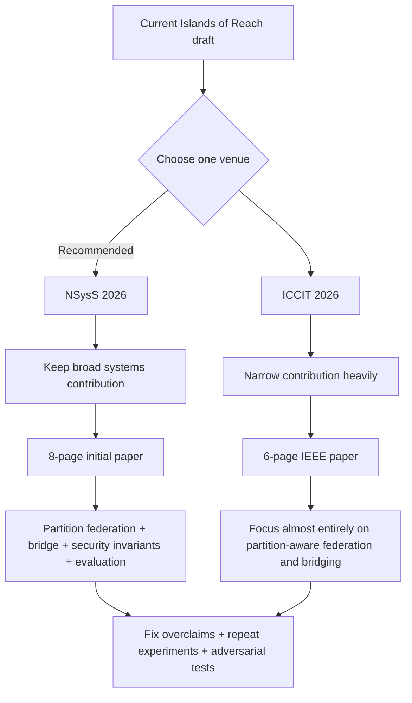
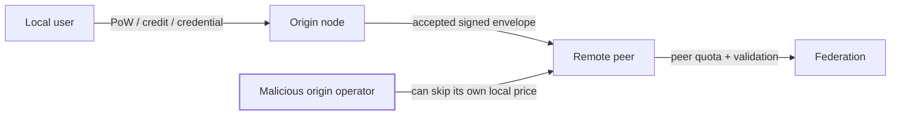

# Deep Research Evaluation of “Islands of Reach” for NSysS 2026 and ICCIT 2026

## Executive Summary

**Overall recommendation: target NSysS 2026, not ICCIT 2026, with the current project.** The project is a much cleaner match for NSysS because that conference explicitly covers network architectures, future Internet design, network simulation/emulation, delay/disruption-tolerant networking, P2P/overlay systems, privacy/anonymity, network security, distributed systems, and social computing. NSysS 2026 also explicitly invites undergraduate researchers and says preliminary or early-stage results are welcome. citeturn17view0turn16view0

ICCIT 2026 is also a valid venue: the work fits its Cyber Security, Communication/Networking, and Cloud/Distributed Computing tracks. However, ICCIT allows **at most six IEEE two-column pages including figures and references**, while NSysS allows **six to eight ACM double-column pages for initial submission**. citeturn14search3turn14search5turn17view0 Your current draft is approximately ten pages, so NSysS requires a manageable reduction; ICCIT requires a fundamental restructuring. fileciteturn0file1

My assessment is:

| Venue | Topic fit | Novelty | Technical depth | Current evidence | Paper-format fit | Overall current state |
|---|---:|---:|---:|---:|---:|---|
| **NSysS 2026** | **5/5** | 3.5/5 | **4.5/5** | 3.5/5 | 3.5/5 | **Borderline Accept → Strong candidate after targeted revision** |
| **ICCIT 2026** | 4.5/5 | 3.5/5 | 4.5/5 | 3.5/5 | **2/5** | **Borderline in current form; good candidate only as a focused six-page paper** |

These scores are my research judgment, **not official acceptance probabilities**. Neither 2026 conference page gives an official acceptance-rate benchmark that would justify a numerical probability estimate. NSysS says it wants original technical work with novel ideas, protocols, algorithms, “ground-breaking results and/or quantified experiences”; ICCIT says papers are reviewed for technical quality, originality, and clarity. citeturn16view0turn14search3

The strongest part of this project is **not any individual cryptographic mechanism**. Most individual components have clear predecessors: signed content, content-derived identifiers, gossip replication, Merkle transparency, anonymous credentials, multipath selection, censorship-resistant publishing, and federated social networks already exist. Your own draft correctly acknowledges this. fileciteturn0file1 The defensible research contribution is instead:

> **A measured composition for keeping a federated public discussion system operating over surviving domestic IP components, including nodes without inbound reachability and a source-bound multi-homed bridge across simulated ISP islands, with uniform verification of signed objects.**

That is a reasonably interesting **systems/networking contribution**, especially because the implementation exposed real engineering failures such as the 407.6-second blocking problem caused by a serial deadline-free peer drain. The paper becomes much weaker whenever it tries to claim that canonical encoding, timestamp-based fork handling, generic anti-abuse, open taxonomies, or transparency logs are independent major novelties. fileciteturn0file0

The biggest research weakness is **external validity**. The main L1–L3 result comes from containers on a single physical host. Your paper itself admits that clocks are shared, routes are virtual, one operator controls everything, and no real multi-ISP field deployment has been completed. fileciteturn0file1 This does not invalidate the work, but it means the paper should claim **“mechanism feasibility under controlled partitions,” not “national-shutdown resilience demonstrated in practice.”**

There is also an important problem with the Bangladesh motivation. The 2024 shutdown is clearly real: Cloudflare measured national Internet traffic and announced IP space falling almost to zero on July 18, with restoration beginning July 23. citeturn24search0turn24search1 More recent operator/BGP analysis also documents staggered prefix withdrawals and upstream shutdown actions. citeturn24search6 However, these observations **do not establish that ordinary customers on different domestic ISPs remained mutually routable while international connectivity was removed**. That exact assumption is central to your L1/L2/L3 story. The paper should therefore present surviving domestic connectivity as an **explicit deployment condition**, not as an empirically established fact about the entire Bangladesh blackout.

The most important technical correction is the Merkle-log wording. Your timestamp/tree-size rule is useful for suppressing stale observations, but it is **not a replacement for consistency verification and should not itself be called fork detection**. RFC 9162 states that Merkle consistency proofs establish the append-only relationship between tree heads. citeturn23search0turn23search1 A malicious log controls its own timestamps, and size-plus-time does not prove that two roots represent the same append-only history. The paper already admits part of this limitation, but the contribution claim should be renamed to something like **“stale-STH suppression during temporary proof unavailability.”**

The other major security weakness is federation anti-abuse. Your receiving node does not charge the origin-specific admission cost again; it relies on peer quotas. That is reasonable engineering, but it means a malicious origin node can accept unlimited identities/events without enforcing its supposed proof-of-work/credential policy and then send valid objects toward peers until federation quotas stop it. Therefore:

> **local user abuse is priced; federated abuse from a malicious server is quota-bounded.**

Do not claim that the whole federation prices spam.

A final critical publication constraint is that **you should not submit the same manuscript simultaneously to NSysS and ICCIT**. NSysS explicitly forbids simultaneous submission to another refereed conference or journal, while IEEE's general submission policy says original work should not already be under review elsewhere. citeturn17view0turn15search2turn15search6 The deadlines overlap: NSysS is August 28, 2026 AoE, while ICCIT is August 31, 2026. citeturn15search4turn14search4 You therefore need to choose one venue now. **I would choose NSysS.**



## Project Scope, Assumptions, and Research Contribution

I evaluated both the detailed project overview and the current manuscript. The project is much larger than the publishable research story: it includes the Forum, signed envelopes, federation, transparency logs, independent audit-log servers, ISP-aware routing and bridging, pseudonymous identities, anti-abuse, Tor, a separate Signal plane, WebRTC exchange, offline bundles, and optional Reticulum/LoRa support. fileciteturn0file0 The draft wisely excludes most of those extra transports from the main L0–L3 evidence, but several of them still consume valuable paper space. fileciteturn0file1

**Important assumptions in this report:** I have the project overview and paper, but I have not independently executed the repository or reproduced the benchmark logs. I therefore treat the 16/16 encoding vectors, 31 federation assertions, 19/19 ISP gate checks, 200/200 propagation observations, 2.1-second cut crossing, 730 invalid requests/second, memory numbers, and ActivityPub byte measurements as **author-reported experimental results**, not independently verified findings. fileciteturn0file0turn0file1 Raw benchmark datasets, complete hardware details, experiment seeds, profiler output, packet traces, and the repository itself were not provided in the materials I analyzed.

The central problem is legitimate. Internet shutdowns are an established research problem; SIGCOMM 2023's *Destination Unreachable* combined shutdown/outage databases, network measurements, operator statistics, and socioeconomic/event data to characterize government shutdowns and spontaneous outages. citeturn13search0turn13search5 Bangladesh's July 2024 event produced an especially severe near-countrywide loss of Internet visibility. citeturn24search0

However, the project should distinguish three questions:

1. **Can users still communicate locally if external transit disappears but a domestic path remains?**
2. **Can independent federated nodes continue exchanging signed content if they can still route to one another?**
3. **Can a multi-homed node relay between two otherwise isolated network components?**

The current testbed provides meaningful evidence for questions two and three under controlled conditions. It does **not** prove that the required domestic routes will exist during a real shutdown.

I strongly recommend changing the paper's vocabulary from **L0/L1/L2/L3** to something like **R0/R1/R2/R3 (“reachability rungs”)**. “L0/L1/L2/L3” is visually similar to conventional networking “layers” and can unnecessarily confuse readers.

The core contribution should also be compressed into three claims.

**Contribution A — Partition-aware federation.** A node can federate over whatever IP paths remain, including a node without a dialable inbound endpoint because both push and catch-up operations can be initiated outbound. This is technically interesting and testable.

**Contribution B — Multi-homed verified bridging.** A bridge with connectivity into two components binds outgoing connections to the correct uplink and relays only after normal object validation. This converts multi-homing from a vague architectural diagram into an experimentally checkable mechanism.

**Contribution C — Measured engineering consequences.** The prototype quantifies propagation, crossing latency, resource cost, invalid-input behavior, and—especially valuable—the 407.6-second availability failure caused by serial peer draining and its correction. fileciteturn0file1

Everything else should support these contributions instead of competing with them.

A stronger title would therefore be:

> **Islands of Reach: Partition-Resilient Federation Across Simulated ISP Islands**

or, slightly broader:

> **Islands of Reach: A Partition-Resilient Federated Forum for Internet Shutdowns**

I prefer **“partition-resilient”** over **“censorship-resistant.”** “Censorship-resistant” invites reviewers to ask whether the system survives traffic analysis, endpoint blocking, bridge coercion, eclipse attacks, complete route removal, Sybil flooding, malicious moderation, and full state-level observation. Your own threat model correctly says it does not solve many of these problems. fileciteturn0file0 “Partition-resilient federation” states the demonstrated contribution much more precisely.

## Conference Fit and Publishability

**NSysS 2026 is the natural venue.** The official CFP explicitly includes network protocols and architectures, future Internet design, network simulation/emulation, delay/disruption-tolerant networks, experimental network results, P2P/overlay/content-distribution networks, privacy and anonymity in distributed systems, security for emerging networks, distributed systems, and social computing. Nearly every central element of Islands of Reach lies inside that scope. citeturn17view0

Even more importantly for this project, NSysS says it wants original technical papers with novel ideas, protocols, algorithms, or **quantified experiences**. citeturn16view0 Your strongest material is exactly quantified systems experience: a functioning prototype, explicit invariants, measured partitions, source binding, backfill, propagation results, memory/load results, and a failure discovered only when several peers were actually deployed. The conference's undergraduate invitation also explicitly says early-stage and preliminary results are welcome. citeturn17view0

For NSysS, my reviewer-style assessment would be:

| Dimension | Assessment | Main reviewer thought |
|---|---|---|
| Problem importance | **Strong** | National shutdowns and fragmented federation are meaningful networking problems. |
| Scope fit | **Very strong** | Direct networking/systems/security match. |
| Novelty | **Medium** | Components are mostly established; composition and operating model must carry novelty. |
| Implementation depth | **Strong** | Multi-language encoding, federation, Merkle logging, source binding, outbox, bridge, anti-abuse and client/server implementation show substantial work. |
| Evaluation depth | **Medium–strong** | Many tests exist, but the most important network result is still a single-host container experiment. |
| Comparative evaluation | **Weak–medium** | ActivityPub byte comparison is too narrow; limited common-testbed comparisons exist. |
| Security validation | **Medium** | Good threat-model honesty, but some security properties remain implementation assertions rather than adversarial evidence. |
| Reproducibility | **Potentially strong** | Repository structure and commands are good, but artifact details need to be exposed clearly in the paper. |
| Current publishability | **Borderline/Weak Accept** | Good systems work; novelty wording and external-validity claims could cause rejection. |
| After recommended fixes | **Solid candidate** | Particularly suitable for the student-friendly NSysS call. |

A likely NSysS reviewer rejection sentence today would be:

> “The implementation is substantial, but most mechanisms are known and the main partition result is demonstrated only in a single-host emulation, so it is unclear what general research conclusion follows.”

Your revision should make that sentence hard to write.

The answer is **not** to invent more features. It is to provide stronger experiments for the existing central mechanism.

ICCIT is also topically appropriate. Its 2026 scope contains Cyber Security, Communication/Networking, and Cloud/Distributed/Edge Computing tracks. citeturn14search5 The problem is mostly **paper shape**, not relevance. ICCIT explicitly scores submissions on technical quality, originality, and presentation clarity, and imposes a strict six-page maximum including references. citeturn14search3 A ten-page systems paper with federation, canonical encoding, transparency, audit certificates, anti-abuse, moderation, classification, Tor, and ISP bridging cannot be compressed to six pages without becoming difficult to read.

For ICCIT I would therefore submit a **different paper shape, not merely a shorter PDF**:

> **Multi-Homed Bridging for Federated Services Under ISP Partitions**

The ICCIT paper should make the ISP partition mechanism the paper. Signed envelopes become one paragraph of background. The ALS disappears. Open-taxonomy classification disappears. Signal disappears. Tor becomes one sentence in limitations. Anti-abuse becomes one sentence. The 19-step pipeline becomes a small diagram or three-stage abstraction.

| Dimension | ICCIT assessment |
|---|---|
| Scope fit | **Strong** |
| Systems depth | **Strong** |
| Novelty | **Medium** |
| Six-page clarity in current form | **Weak** |
| Evidence | **Medium–strong if focused** |
| Current manuscript as submission | **Not recommended** |
| Focused six-page networking version | **Competitive candidate** |

There is no defensible basis for saying ICCIT is “easier” or NSysS is “harder” because their 2026 pages do not publish directly comparable acceptance-rate data. ICCIT's stated criteria are technical quality, originality, and clarity; NSysS emphasizes original technical contributions and quantified systems experience. citeturn14search3turn16view0

The submission strategy is therefore important. NSysS's initial deadline is **August 28, 2026 AoE**, notification October 30, and camera-ready deadline November 6. citeturn15search4turn17view1 ICCIT's deadline has been extended to **August 31, 2026**, with notification October 15 and camera-ready/author registration on November 1. citeturn14search1turn14search4 Because the decisions arrive long after both submission deadlines, ICCIT cannot serve as a normal fallback after waiting for an NSysS decision.

And the same manuscript cannot ethically be placed under review at both. NSysS explicitly prohibits this, while IEEE's submission policy says work should not simultaneously be under review in another refereed publication. citeturn17view0turn15search2

**Venue recommendation: submit the revised core paper to NSysS 2026.**

## Technical Claim Audit

The draft is unusually good at stating limitations. That is a strength. But several important statements still go beyond the evidence.

| Claim or issue | Verdict | Why it is risky | What would fix it |
|---|---|---|---|
| **“The Bangladesh blackout withdrew international transit rather than internal networks.”** | **Unproven / too strong** | Cloudflare confirms near-zero global traffic and route announcements; newer BGP/operator evidence confirms upstream shutdown actions. Neither proves that ordinary domestic cross-ISP routing remained usable. citeturn24search0turn24search6 | Say the design targets shutdowns **where domestic IP components survive**. Provide domestic-routing evidence if available; otherwise call it a deployment assumption. |
| **“Circumvention systems fail at a full transit cut.”** | **Correct only when narrowly scoped** | Telex depends on paths toward friendly infrastructure, and Snowflake proxies forward clients toward a centralized Tor bridge. citeturn18search9turn19search4 But “circumvention systems” as a universal category is broader than these examples. | Say: “The external-relay circumvention systems we examine require a surviving route outside the isolated region.” |
| **“Federated systems assume global reach.”** | **Overstated** | Federated instances can continue serving their local state while remote federation fails. Mastodon research does show infrastructure concentration and fragmentation risk, including a simulated LCC fall from 92% to 46% after removing five ASes. citeturn13academia48turn13search6 | Say: “Standard cross-instance federation requires routability to the remote instance and does not itself provide a mechanism for rejoining otherwise unroutable ISP components.” |
| **“Author signing removes withheld approval as a censorship mechanism.”** | **Semantically incorrect** | A signature proves authenticity/integrity. A server can still reject admission, omit federation, hide content, block reads, or refuse discovery. | Say: “Author authenticity does not depend on server approval.” Keep availability/moderation as separate properties. |
| **Canonicalisation is a novel ‘third position’ completing a three-position design space.** | **Novelty not established** | Protobuf officially warns that serialization is non-canonical and that deterministic serialization is not canonical across languages. citeturn23search2turn23search3 Your custom strict profile is reasonable, but claiming uniqueness requires a much wider review of canonical CBOR, DAG-CBOR, JCS-style encodings, blockchain formats, and other reject-on-noncanonical protocols. | Present it as a **design invariant**, not a main novelty claim. |
| **16/16 cross-language vectors establish canonical compatibility.** | **Useful evidence, insufficient assurance** | Sixteen vectors can catch known edge cases but cannot cover a complicated binary-format state space. Protobuf explicitly lists reasons serialization can vary across implementations/builds. citeturn23search2turn23search3 | Add property-based/differential fuzzing over at least tens of thousands of generated and mutated messages across TypeScript, Rust and Python. |
| **Timestamp + tree size is fork detection.** | **Technically too strong** | RFC 9162 uses Merkle consistency proofs to prove append-only consistency. citeturn23search0turn23search1 Timestamp ordering only decides that an observation appears stale; a malicious log signs its own timestamps. | Rename it **stale-head suppression**. Compare roots too. Fetch a consistency proof as soon as connectivity returns. |
| **Smaller/newer tree = fork** | **Reasonable alarm signal, not a complete proof system** | It detects one obvious form of regression but does not by itself cover equal-size/different-root or larger-size/inconsistent-root equivocation. | Add explicit cases for same-size/different-root and larger inconsistent histories. |
| **“Spam is priced rather than policed by identity.”** | **Only locally true** | A malicious origin server can deliberately skip its own local payment rule and send syntactically valid events to peers. Receiving peers rely on quotas, not the original admission price. | State: **local submission is priced; malicious federated senders are quota-bounded.** Test a hostile origin. |
| **Multi-homed bridge reconnects ISP islands.** | **Conditionally true** | It works only if the bridge has real, usable routes on both sides and policies/firewalls/NAT permit connections. The container test proves your software path under a simulated topology, not real ISP policy. | Perform at least one two-provider physical or VM field experiment. Until then say **“reconnects the simulated islands.”** |
| **“Cut path is comparable to healthy path.”** | **Unsupported statistically** | 1.9 versus 2.1 seconds in a small controlled sequence is not enough to claim equivalence. fileciteturn0file1 | Run ≥30 independent trials per condition, report distributions and bootstrap confidence intervals. |
| **200/200 posts with zero loss proves reliable propagation.** | **Observed result, not reliability guarantee** | Zero losses in 200 samples only says no loss was observed under that workload. | Phrase exactly that way. Add loss, burst-load, disconnect/reconnect and queue-saturation sweeps. |
| **730 invalid req/s and zero database writes establish DoS resistance.** | **Too broad** | This proves a useful no-write invariant for one invalid-input workload. It does not cover CPU exhaustion, sockets, valid-signature floods, queue growth, bandwidth, or malicious authenticated peers. Your paper already admits most of this. fileciteturn0file1 | Rename experiment “invalid-envelope write amplification.” Add a valid-envelope flood. |
| **Pseudonymity follows from no email/phone and no persistent IP-key map.** | **Reasonably scoped only because you explicitly disclaim anonymity** | Reverse proxies, OS logs, server metrics, packet metadata, crash traces, timing and stylometry can still link users. | Keep the current “pseudonymity, not anonymity” wording. Add a logging/data-flow audit. |
| **ALS gives independent proof that a server accepted content.** | **Needs careful wording** | The ALS independently verifies and retains a server-signed acknowledgement; it does not independently observe the server's database transaction. | Say “independently retained and verified evidence of the server's signed acknowledgement.” |
| **Projection + Merkle append in one transaction guarantees receipt consistency.** | **Likely, but crash ordering needs testing** | The critical edge cases occur between commit, receipt generation, client receipt, and crash/restart. | Fault-inject crashes immediately before/after commit and before/after receipt generation. |
| **ActivityPub overhead is 19.5–25.9× larger.** | **Measured but easy to attack as an unfair baseline** | Fixed-schema Protobuf and JSON-LD optimize for different goals; only 80 activities from two instances were sampled; authored content differs; HTTP/authentication/fanout are omitted. Your draft acknowledges some of this. fileciteturn0file1 | Compare identical semantic objects, show raw + gzip + full delivered message, document sampling, and call it a **wire-format case study**, not general system efficiency. |
| **“First” or unique L0–L3 measurement claim.** | **High novelty risk** | A “first” claim requires a broader systematic review than the current related-work discussion demonstrates. | Remove “first” unless you can formally document search methodology and no prior equivalent system. |
| **Open taxonomy/classification extension strengthens the paper.** | **No; currently harms focus** | It is specified but not implemented or evaluated. fileciteturn0file1 It introduces another research topic without supporting the partition result. | Remove the entire classification section from both submissions. Keep it for later work. |

The fork issue deserves special emphasis. A transparency system fundamentally cares about **roots**, not just sizes. Consider these cases:

| Old observation | New observation | Proper interpretation |
|---|---|---|
| size 8, root A, time 100 | size 6, root X, time 90 | Probably stale observation; do not overwrite trusted state |
| size 8, root A | size 8, root B | **Strong equivocation evidence** if both are validly signed by the same log |
| size 8, root A | size 10, root C | Unknown until a consistency proof establishes that A is a prefix of C |
| size 8, root A | size 6, root X, time 110 | Regression alarm |
| size 8, root A | size 100, root X | Bigger does **not** mean consistent; request consistency proof |

RFC 9162 is explicit that Merkle consistency proofs establish the append-only relationship. citeturn23search0turn23search1 Your timestamp rule is therefore best framed as a **safe local behavior while proof retrieval is temporarily impossible**, not as a new replacement for CT consistency.

The anti-abuse issue is similarly important because it changes the threat model:



The correct conclusion is:

> Cryptographic validity can be checked everywhere. **Economic admission cannot be trusted to have happened at another independently controlled server unless the proof is transferable and externally verifiable.**

That is not necessarily a fatal flaw. Peer quotas are a perfectly reasonable answer. The paper simply needs to distinguish the two mechanisms honestly.

## Literature Landscape and Novelty Position

The literature does **not** show an obvious prior system identical to Islands of Reach. However, almost every mechanism has a close predecessor. That means your novelty has to come from the **specific composition and evaluation under ISP partition**, not from claiming invention of signing, gossip, transparency logs, anonymous admission, or censorship-resistant replication.

The similarity score below is my own 0–100 assessment. It measures conceptual overlap with Islands of Reach, not research quality.

| Paper | Authors / year / venue | Main method | Dataset / evaluation | Notable result | Similarity | URL |
|---|---|---|---|---|---:|---|
| **Secure Scuttlebutt: An Identity-Centric Protocol for Subjective and Decentralized Applications** | Dominic Tarr, Erick Lavoie, Aljoscha Meyer, Christian Tschudin; 2019; ACM ICN | Signed append-only author feeds; decentralized replication | Protocol/system implementation | Very close prior art for signed, offline-friendly decentralized social information, though its topology and server model differ | **88/100** | https://dblp.org/rec/conf/acmicn/TarrLMT19 citeturn21search0 |
| **Challenges in the Decentralised Web: The Mastodon Case** | Aravindh Raman, Sagar Joglekar, Emiliano De Cristofaro, Nishanth Sastry, Gareth Tyson; 2019; ACM IMC | Measurement of federated Mastodon infrastructure, users, graph and availability | Real Mastodon federation measurements | Removing five major ASes can reduce the largest connected component from about 92% to 46% of users in their analysis | **78/100** | https://arxiv.org/abs/1909.05801 citeturn13academia48turn13search6 |
| **Design and Evaluation of IPFS: A Storage Layer for the Decentralized Web** | Dennis Trautwein et al.; 2022; ACM SIGCOMM | Content-addressed P2P storage, DHT routing and decentralized retrieval | DHT crawls, controlled nodes, retrieval measurements | Observed IPFS peers in more than 2,700 ASes and 152 countries; evaluated publication/retrieval performance | **73/100** | https://doi.org/10.1145/3544216.3544232 citeturn20search2turn20academia48 |
| **Publius: A Robust, Tamper-Evident, Censorship-Resistant Web Publishing System** | Marc Waldman, Aviel Rubin, Lorrie Cranor; 2000; USENIX Security | Replicated encrypted publication, threshold reconstruction, source protection | Implemented prototype | Censorship/tamper-resistant web publishing with update/delete support | **70/100** | https://www.usenix.org/conference/9th-usenix-security-symposium/publius-robust-tamper-evident-censorship-resistant-and citeturn18search4 |
| **Freenet: A Distributed Anonymous Information Storage and Retrieval System** | Ian Clarke, Oskar Sandberg, Brandon Wiley, Theodore Hong; 2001; Privacy Enhancing Technologies workshop | Decentralized anonymous storage and adaptive P2P routing | Prototype/network design | Foundational censorship-resistant distributed storage system | **68/100** | https://freenet.org/about/faq/ citeturn22search2turn22search4 |
| **Tangler: A Censorship-Resistant Publishing System Based on Document Entanglements** | Marc Waldman, David Mazières; 2001; ACM CCS | Entangles new blocks with older blocks so publication helps preserve existing material | System design/prototype | Makes replication of old content part of publishing new content | **64/100** | https://doi.org/10.1145/501983.502002 citeturn22search15 |
| **Snowflake, a Censorship Circumvention System Using Temporary WebRTC Proxies** | Cecylia Bocovich, Arlo Breault, David Fifield, Serene, Xiaokang Wang; 2024; USENIX Security | Dynamic WebRTC proxies forwarding toward a centralized Tor bridge | Multi-year real deployment including censorship events | Demonstrates practical, dynamically discovered circumvention proxies; nevertheless relies on a path toward external Tor infrastructure | **61/100** | https://www.usenix.org/conference/usenixsecurity24/presentation/bocovich citeturn19search4 |
| **Destination Unreachable: Characterizing Internet Outages and Shutdowns** | Zachary Bischof et al.; 2023; ACM SIGCOMM | Combines Internet measurements and curated shutdown/outage/event datasets | Longitudinal shutdown/outage dataset plus operator and event data | Gives rigorous empirical basis for studying national Internet shutdowns | **58/100** | https://doi.org/10.1145/3603269.3604883 citeturn13search0turn13search5 |
| **Aggregation-Based Certificate Transparency Gossip** | Rasmus Dahlberg, Tobias Pulls, Jonathan Vestin, Toke Høiland-Jørgensen, Andreas Kassler; 2018; ARES | Off-path aggregation and CT consistency checking | 20 days of RIPE Atlas measurements; clients from ~3,500 ASes and ~40% IPv4 space; P4/XDP prototype | Packet-processing prototype reached 10-Gbps line rate and studied split-view detection coverage | **55/100** | https://arxiv.org/abs/1806.08817 citeturn21academia43 |
| **Practically-Exploitable Cryptographic Vulnerabilities in Matrix** | Martin Albrecht, Sofía Celi, Benjamin Dowling, Daniel Jones; 2023; IEEE S&P | Adversarial analysis of a federated encrypted communication system | Practical proof-of-concept attacks | Shows how individually established cryptographic building blocks can fail when composed incorrectly in a real federated system | **52/100** | https://doi.org/10.1109/SP46215.2023.10351027 citeturn21search1turn21search13 |
| **Privacy Pass: Bypassing Internet Challenges Anonymously** | Alex Davidson, Ian Goldberg, Nick Sullivan, George Tankersley, Filippo Valsorda; 2018; PETS | Blind/anonymous tokens separating challenge completion from later redemption | Browser implementation and Cloudflare integration | One-round-trip cryptographic protocol enabling anonymous reusable access tokens | **43/100** | https://doi.org/10.1515/popets-2018-0026 citeturn20search0 |
| **Will Admins Cope? Decentralized Moderation in the Fediverse** | Ishaku Hassan Anaobi, Aravindh Raman, Ignacio Castro, Haris Bin Zia, Damilola Ibosiola, Gareth Tyson; 2023; The Web Conference | Empirical study of moderation burden and decentralized administration | Fediverse administration/moderation measurements | Shows that decentralization moves significant operational and moderation burdens to instance administrators | **42/100** | https://arxiv.org/abs/2302.05915 citeturn22academia48turn22search7 |

This landscape gives a much better novelty argument than the present “each mechanism is known, but the combination is new” wording.

The paper should say something closer to:

> Prior censorship-resistant publishing systems focus primarily on replication against host removal; circumvention systems such as Telex and Snowflake preserve access by reaching infrastructure beyond the censor; decentralized systems such as Secure Scuttlebutt and IPFS provide signed/content-addressed or offline-friendly replication; and federated platforms such as Mastodon expose significant infrastructure concentration. citeturn18search4turn18search9turn19search4turn21search0turn20search2turn13academia48 We study a narrower systems question: how server-to-server public discussion behaves when global transit and then inter-ISP reachability are deliberately removed, and whether a normal multi-homed verifying node can restore federation between the resulting components.

That is specific, defensible, and testable.

The Mastodon paper is particularly useful for motivation because it empirically demonstrates that decentralized software does not automatically imply decentralized infrastructure: their measurement showed substantial hosting concentration, and removal of a small number of ASes severely fragmented the graph. citeturn13search6 That is a stronger argument for your work than saying simply that “ActivityPub assumes L0.”

The Secure Scuttlebutt comparison must also become more prominent. It is probably your closest conceptual competitor because signed append-only information and intermittent/offline-friendly decentralized social replication are central to its design. citeturn21search0 The correct argument is not that your system is “more decentralized”; it is that **SSB and Islands of Reach choose different network and operational models**. Your paper emphasizes independent server operators, server federation, reachability scopes, multi-homed ISP bridging, server-side moderation, and auditable server acknowledgement.

The IPFS paper is a model for how your evaluation should evolve. It does not stop at an architecture diagram; it combines design with systematic measurement across thousands of ASes and countries. citeturn20search2 You cannot reproduce that scale before the 2026 deadline, but it sets the standard for what a later journal or stronger systems-conference version should become.

Finally, the Matrix security paper is important even though it is not a direct competitor. It demonstrates exactly why a complex protocol cannot rely on “we use standard cryptography” as its security argument: the authors found practical failures caused by design, protocol confusion, domain separation and implementation composition. citeturn21search1 Because Islands of Reach also combines signatures, identity planes, certificates, replay checks, transparency, federation, anti-abuse and multiple implementations, **systematic adversarial testing is itself publishable evidence.**

## Experiments, Revisions, and Paper Structure

With only about one week before NSysS, the goal should **not** be to add another subsystem. The goal should be to turn existing claims into harder evidence.

I would rank the experiments as follows.

| Priority | Experiment | Why reviewers need it | Minimum useful design |
|---|---|---|---|
| **Critical** | Repeated island-crossing experiment | Current 0.5/1.2/2.1-second sequence is too close to a single observation | ≥30 independent trials each for healthy, cut, blackholed peer, bridge failover; median, p95, p99, 95% bootstrap CI |
| **Critical** | Malicious-origin federation flood | Tests the main gap created by origin-only anti-abuse pricing | Honest origin vs origin that skips cost; sweep peer quotas; measure CPU, bandwidth, DB writes, queue length and accepted rate |
| **Critical** | Transparency adversarial trace test | Prevents a security reviewer from breaking the timestamp heuristic immediately | stale smaller head; newer smaller; same-size/different-root; larger/inconsistent; future timestamp; reordered heads; proof restoration |
| **Critical** | Cross-language differential fuzzing | Sixteen vectors are too few for a canonical binary format | Generate/mutate ≥100,000 envelopes; TS/Rust/Python must agree on accept/reject and exact signed bytes |
| **High** | Loss/latency partition sweep | Virtual zero-loss networks are unrealistic | `tc/netem`: 0, 1, 5, 10% loss; 10–500 ms latency; reconnect/backfill; report delivery and time-to-convergence |
| **High** | Queue/backpressure load sweep | Existing burst result shows severe first-hop queueing | 1, 10, 50, 100, 250 writes/s; queue depth and latency over time; determine saturation point |
| **High** | Crash-consistency fault injection | Strengthens ALS/receipt claim | Crash before commit, after commit-before-receipt, after receipt, during fanout; restart and verify projection/log/receipt invariants |
| **High** | Federation ablations | Shows which mechanisms actually matter | source binding off/on; per-peer concurrency off/on; backfill off/on; bridge off/on |
| **Medium** | One external baseline | Reduces “no comparison” criticism | Prefer a lightweight ActivityPub implementation or closest practical federated baseline; compare behavior, not merely byte size |
| **Medium** | Real two-network bridge | Biggest external-validity improvement | One machine on ISP A/mobile network A and another on ISP B; dual-homed bridge; repeat basic crossing |
| Later | User-understanding study | Important but cannot safely be rushed | Evaluate whether people correctly understand freshness, provenance, scope and pseudonymity |
| Later | Multi-operator deployment | Strongest eventual paper | Nodes run by genuinely independent operators with independent clocks, networks and policies |

The most valuable statistical change is simple: **stop reporting important networking results as individual numbers. Report distributions.**

For example, instead of:

> “The post crossed in 2.1 seconds.”

write:

> “Across 50 independent cut-path trials, renderable-post latency had median X ms, p95 Y ms and p99 Z ms; the 95% bootstrap confidence interval for the median was […].”

That single change makes the evaluation look much more like research.

For propagation, separate four variables:

\[
T_{\text{delivery}}
=
T_{\text{queue}}
+
T_{\text{verify}}
+
T_{\text{commit}}
+
T_{\text{fanout/network}}
\]

Your existing paper already discovered that queueing dominates some load regimes. fileciteturn0file1 Turn this into a result rather than treating it as noise. Sweep drain interval and offered load independently and show where the system transitions from propagation-dominated to queue-dominated behavior.

The same principle applies to bridge evaluation. Test:

\[
\text{delivery success}
=
f(\text{loss},\text{RTT},\text{offered load},\text{peer failure},\text{uplink failure})
\]

A small matrix is far stronger than a larger number of unrelated features.

**Canonical encoding** should also be moved from “novel protocol idea” to **correctness engineering**. Google's official Protobuf documentation says serialization is not canonical and warns that even deterministic serialization is not canonical across languages or stable across builds. citeturn23search2turn23search3 Your decision to define a restricted accepted profile is therefore sensible. But prove the profile by fuzzing:

```text
Generate semantic envelope
        ↓
Encode in TS ─┐
Encode in Rust├── exact byte equality?
Encode in Py ─┘
        ↓
Apply controlled mutations
        ↓
Do all implementations make the same accept/reject decision?
        ↓
For accepted messages:
same content_id + same signature bytes
```

Include mutations such as field reordering, unknown fields, omitted defaults, duplicate encodings where the wire format permits them, Unicode normalization edge cases, very large fields, malformed lengths, and boundary integers. The exact cases should follow your restricted schema.

The **external baseline** should be kept realistic given the deadline. Do not spend the remaining week installing and tuning five unrelated systems. One external baseline plus strong internal ablations is better.

For example:

| Comparison | Question answered |
|---|---|
| Bridge enabled vs disabled | Does the bridge actually create the only cross-island application path? |
| Serial vs concurrent peer drain | Does the identified design invariant explain the 407.6 s failure? |
| Source binding enabled vs disabled | Is source selection load-bearing under multi-homing? |
| Backfill enabled vs disabled | Does recovery close disconnected-period gaps? |
| Your forum vs one ActivityPub implementation | What happens to cross-instance posting when ordinary server-to-server routing is severed? |
| Your compact envelope vs equivalent ActivityPub object | What is the real wire-cost difference for equivalent semantics? |

Do not claim that an ActivityPub instance “fails” because it does not implement a feature outside ActivityPub's intended design. Say the comparison establishes **different availability assumptions**.

The ActivityPub byte comparison also needs refinement. The current draft uses 80 real activities from two instances and carefully notes that JSON-LD buys extensibility and that HTTP/authentication are omitted. fileciteturn0file1 Keep those caveats. Ideally generate the *same semantic message* in both systems, then show:

| Layer | Your system | ActivityPub baseline |
|---|---:|---:|
| Authored text | same | same |
| Application object | X B | Y B |
| Compressed object | X B | Y B |
| Federation authentication | X B | Y B |
| HTTP headers | X B | Y B |
| Total bytes for one delivery | X B | Y B |

That is much harder to criticize than subtracting authored text from heterogeneous observed posts.

The current draft should also become dramatically narrower. fileciteturn0file1 For **NSysS**, I would use this approximate eight-page budget:

| Content | Approx. pages |
|---|---:|
| Abstract | 0.25 |
| Introduction + contributions | 0.75 |
| Related work | 0.75 |
| Design and threat assumptions | 1.50 |
| Partition-aware federation/bridge | 1.00 |
| Evaluation | **2.50** |
| Limitations + conclusion | 0.35 |
| References | ~0.90 |
| **Total** | **~8.0** |

That means deleting or compressing aggressively.

**Remove entirely:** the open-taxonomy/classifier section. It is not evaluated and is unrelated to the main network contribution. fileciteturn0file1

**Move to one-sentence scope statements:** Signal, ML-KEM encrypted messaging, Reticulum/LoRa, detailed Tor setup, WebRTC, offline bundles, attachment adapters, Bangla UI, panic wipe.

**Compress heavily:** the full nineteen-step explanation. Keep the security-relevant abstraction:

> parse/cryptographic rejection without writes → semantic admission → atomic projection+witness → receipt/fanout.

Keep only the pipeline orderings that matter to claims.

**Keep prominently:** the 407.6-second failed bridge crossing and the design change that solved it. Unexpected system failures are often more scientifically useful than polished success results.

**Keep prominently:** no-inbound bidirectional federation, because this is a concrete architectural property rather than a generic decentralization claim.

**Keep but rename:** timestamp-based log handling as stale-observation suppression.

**Reduce:** the ALS to perhaps half a column unless the acknowledgement-evidence mechanism becomes one of the explicit top three contributions.

For ICCIT, a six-page paper should be even narrower:

> **Problem → reachability model → outbound-only federation → source-bound bridge → experimental topology → repeated failure/failover results → limitations.**

Canonical encoding, ALS and anonymous credentials should become implementation details or disappear.

The abstract also needs simplification. Right now it tries to teach the reader almost the entire system. A stronger NSysS abstract would follow this structure:

> **Problem:** Federated services normally lose cross-instance communication when the network route between instances disappears.  
> **Gap:** During a national or inter-ISP partition, external circumvention infrastructure may also be unreachable.  
> **System:** We build a federated public forum whose signed objects can continue to replicate over surviving domestic paths; nodes without inbound reachability use outbound synchronization, and an explicitly configured multi-homed node can relay between isolated components.  
> **Method:** We evaluate the system in a controlled partition testbed under route removal, peer blackholes, multi-hop propagation, invalid-input load, and resource constraints.  
> **Key results:** Give only the strongest repeated results.  
> **Boundary:** The experiments demonstrate mechanism feasibility in a controlled testbed, not availability during every shutdown or anonymity against network observers.

That is enough.

## Publication Requirements, Timeline, and Submission Checklist

The formatting issue is immediately important. The supplied draft parses as **ten pages**. fileciteturn0file1 NSysS 2026 requires initial submissions to be **six to eight double-column pages including figures, tables, appendices, and references**, using the Standard ACM Conference Proceedings Template. The paper must be PDF, double-blind, and contain no author-identifying references. Submission is through Microsoft CMT. citeturn17view0turn17view1

If accepted as an NSysS full paper, the camera-ready page currently states a **nine-page maximum including figures, tables, references, and appendix**; the listed short-paper limit is five pages. NSysS says its 2026 proceedings will be part of ACM ICPS and handled through ACM's rights/TAPS workflow. citeturn17view1 The conference also warns authors about plagiarism and AI-generated content and says submissions will be checked. citeturn17view1

NSysS's switch to ACM's current open-access model also matters financially: the official CFP warns that authors whose institutions are not covered by ACM Open and who do not qualify for a waiver may face an article processing charge. citeturn17view0 Do **not** assume either that BUET is covered or that you will owe an APC until you check the current ACM Open institutional status.

ICCIT requires an original, unpublished PDF using the **IEEE A4 conference template, two columns, maximum six pages including figures and references**. Reviews are double-blind. ICCIT states particularly strongly that author names, affiliations, addresses, and emails must not appear in the initial manuscript and that failure to maintain anonymity can cause immediate rejection. Submission is through Microsoft CMT. citeturn14search3

ICCIT says accepted **and presented** papers will be submitted to IEEE Xplore, subject to IEEE Xplore scope and quality requirements. citeturn14search1turn14search5 Its currently published local author fees are BDT 8,000 for an IEEE student member, BDT 10,000 for a non-IEEE student, BDT 12,000 for an IEEE member, and BDT 14,000 for a non-IEEE member; one author registration covers one paper. citeturn14search10

The mandatory and recommended requirements can therefore be separated clearly:

| Requirement | NSysS 2026 | ICCIT 2026 | Status for this project |
|---|---|---|---|
| Original unpublished work | **Required** | **Required** | Must confirm |
| Simultaneous submission elsewhere | **Forbidden** | IEEE policy generally forbids concurrent review | **Choose one venue** citeturn17view0turn15search2 |
| Initial page limit | **6–8 pages incl. refs** | **≤6 pages incl. refs** | Current 10-page draft fails both fileciteturn0file1 |
| Format | ACM `sigconf` / standard proceedings template | IEEE A4 two-column | Rewrite required |
| Double blind | **Yes** | **Yes; explicit desk-rejection risk** | Check repository links/self-citations too |
| Submission | Microsoft CMT | Microsoft CMT | Required |
| Dataset publication | Not stated as mandatory | Not stated as mandatory | Strongly recommended |
| Source/artifact release | Not stated as mandatory | Not stated as mandatory | Strongly recommended |
| Repeated/statistical evaluation | Not formally mandated | Not formally mandated | Needed for credibility |
| Human-subject approval | Relevant if human participants are added | Follow institutional/IEEE ethics if humans added | Current container experiments do not appear to involve humans |
| Presentation if accepted | Conference supports online presentation in unavoidable cases | Accepted **and presented** papers are eligible for Xplore submission | Plan for presentation citeturn16view0turn14search1 |
| Camera ready | Nov. 6 | Nov. 1 | Future |
| Publication fee | Possible ACM ICPS APC depending on institution/waiver | Published author registration fee | Budget now |

On **ethics**, the present container/software evaluation does not appear to involve human participants. Therefore a human-subject ethics approval is not obviously necessary from the supplied methodology. However, that changes immediately if you run interviews, usability studies, deploy to real users, capture users' traffic, study sensitive shutdown behavior, or retain identifiers. ACM's publication framework requires researchers doing human-subject work to follow the ethics-review requirements of their research environment and to be prepared to document compliance. citeturn14search6turn14search13 IEEE likewise requires accurate, ethical reporting and original research. citeturn15search8

Because the application concerns potentially vulnerable users during political shutdowns, a future field trial deserves **more**, not less, ethical care. Logging IP addresses, timing, social graphs, political posts, pseudonymous identities, or bridge usage could create a dataset whose compromise harms participants. A field study should therefore be designed around data minimization, informed consent where appropriate, retention limits, secure storage, and institutional ethics review before collection. Do not add a rushed user study this week merely to make the evaluation look bigger.

For reproducibility, publish an anonymous artifact at submission time if double-blind policy permits it, or be prepared to release it immediately afterward. At minimum it should contain:

| Artifact | What should be included |
|---|---|
| Topology | Compose/network definitions for islands, exchange link and bridge |
| Workloads | Exact generators for propagation, flood and read experiments |
| Configuration | Drain intervals, quotas, payload sizes, database/cache settings |
| Environment | CPU model, host RAM, kernel, Docker/runtime, Node/Rust/Python versions |
| Raw results | CSV/JSON for every individual trial, not only summary values |
| Analysis | Script producing every table/graph from raw results |
| Protocol | Protobuf definitions and canonicalisation profile |
| Conformance | Existing vectors plus generated/fuzz corpus |
| Security tests | Fork/equivocation, replay, wrong receipt, malformed encoding, malicious peer cases |
| Seeds | Random seeds wherever randomness affects workloads |
| Build | One-command or very small documented reproduction procedure |

Your project overview already contains a good start: build, test, vector, smoke, ISP and gate commands are documented. fileciteturn0file0 Turn that implementation discipline into a publication asset.

A comfortable local machine for the stronger container experiments would likely have roughly **16–32 GB RAM and several CPU cores**, rather than trying to reproduce all multi-node load tests inside the stated 512 MB target. This is a planning recommendation, not a requirement from either conference. For the real-network experiment, the valuable resource is not a GPU; it is **two genuinely independent network paths**. The project does not need expensive ML compute.

The immediate schedule is extremely tight. As of **Friday, August 21, 2026**, NSysS is due August 28 AoE and ICCIT is due August 31. citeturn15search4turn14search4 An AoE deadline means the formal NSysS cutoff occurs later than August 28 in Bangladesh time, but relying on that final timezone window is unnecessarily risky.

| Date | NSysS-focused work |
|---|---|
| **Aug 21** | Freeze feature development. Decide the three contribution claims. Change title and remove overclaims. Delete classification/open-taxonomy material from paper. |
| **Aug 22** | Run ≥30 repeated healthy/cut/blackhole bridge trials. Save raw data. |
| **Aug 23** | Run malicious-origin/peer-quota tests and valid-envelope flood. |
| **Aug 24** | Implement transparency adversarial traces and canonical differential fuzzing. |
| **Aug 25** | Run loss/RTT sweeps and core ablations: bridge, backfill, source binding, concurrency. |
| **Aug 26** | Rewrite evaluation around these results. Compress manuscript to eight pages. |
| **Aug 27** | Final related-work/claim audit, anonymous-artifact check, references, figures, grammar and format review. |
| **Aug 28** | Submit NSysS well before the deadline. Do not use the extra AoE hours as normal working time. |

If ICCIT is chosen instead, use August 21–26 for the same experiments, then spend August 27–29 producing a **new focused six-page IEEE version**, perform the blind-format check on August 30, and submit before August 31. ICCIT does not state the deadline timezone on the important-dates page, so submitting a day early avoids ambiguity. citeturn14search4

The post-submission timeline is:

| Venue | Notification | Camera-ready / registration | Conference |
|---|---|---|---|
| **NSysS 2026** | Oct. 30, 2026 AoE | Camera-ready Nov. 6 | Dec. 17–19, Cox's Bazar citeturn15search4turn16view0 |
| **ICCIT 2026** | Oct. 15, 2026 | Camera-ready + author registration Nov. 1 | Dec. 18–20, Cox's Bazar citeturn14search4turn14search1 |

The final submission checklist should be treated as a hard gate:

| Check | Required state before submission |
|---|---|
| **Venue selected** | NSysS **or** ICCIT; not both with the same manuscript |
| **Paper claim** | “Partition-resilient federation under surviving IP connectivity,” not “censorship-proof communication” |
| **Bangladesh motivation** | Do not claim proven domestic cross-ISP reachability without evidence |
| **Novelty statement** | Composition + reachability model + measured bridge/federation behavior |
| **Canonical encoding claim** | Design invariant supported by fuzzing; not claimed as obviously unique |
| **Fork claim** | Rename to stale-observation suppression; consistency proofs remain authoritative |
| **Anti-abuse claim** | Distinguish local priced admission from federated peer quotas |
| **Bridge claim** | Say “simulated ISP islands” unless a real two-network test is completed |
| **Important latency result** | Distribution + p95/p99/CI, not one 2.1-second observation |
| **Flood result** | Separate invalid-input no-write result from general DoS resistance |
| **ActivityPub result** | Equivalent semantics and explicit limitations |
| **Unimplemented work** | Remove open-taxonomy/classifier contribution |
| **Threat model** | Keep explicit surviving-path and honest-observer assumptions |
| **Limitations** | Keep one-host container, single operator, no real shutdown, no traffic anonymity |
| **Reproducibility** | Raw results + scripts + configuration + version information |
| **NSysS pages** | 6–8 including references citeturn17view0 |
| **ICCIT pages** | ≤6 including references citeturn14search3 |
| **Anonymity** | No names, affiliations, identifying acknowledgements or revealing self-references |
| **Template** | Correct ACM `sigconf` for NSysS or IEEE A4 two-column for ICCIT |
| **Ethics** | No undocumented human/user data; approval/consent in place if such research is added |
| **References** | Cite closest prior art, especially SSB, Mastodon, IPFS, CT, shutdown measurement and censorship systems |
| **Artifact anonymity** | Repository/URLs must not reveal authors during double-blind review |
| **Final PDF** | Fonts embedded, figures legible, no clipping, no accidental author metadata |
| **Deadline buffer** | Submit at least several hours early |

The project is **publishable in principle**. It is already substantially beyond a typical undergraduate “software project” because it has a defined adversary, protocol invariants, multiple implementations, a nontrivial distributed prototype, controlled network partitions, performance measurements, failure discovery, and explicit limitations. fileciteturn0file0turn0file1 What currently keeps it from being a clearly strong research submission is not lack of code or lack of features. It is that the paper sometimes makes a larger scientific claim than the experiment establishes.

For NSysS, the best final story is therefore very simple:

> **We do not claim that every national shutdown leaves a usable network. We ask what a federated public discussion service can do when some domestic IP components survive. We build a system that continues locally, synchronizes through outbound-only federation, and can cross otherwise isolated components through an explicitly multi-homed verifying node. We then deliberately break the topology, measure the resulting behavior, find concrete availability failures, fix them, and clearly state where the mechanism stops working.**

That story is narrower than the current paper, but it is also substantially more defensible—and substantially more competitive for **NSysS 2026**.